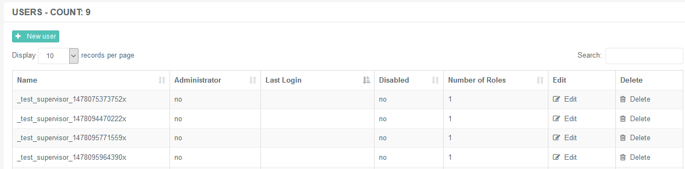

# Access Control - User Accounts, Roles and Permissions

## Introduction to Role-Based Access Control

Role-based access control is a method of regulating access to software
resources based on different roles of users within an organisation. It
enables fine-graining of access management by specifying roles that
define who can access what and which areas of a software system and
under what conditions.  It also allows users to be assigned to certain
groups (roles) with particular capabilities and proper permissions. 

Access or privilege right is the ability to perform a specific task,
such as view, create, edit or delete resources. 

### User Accounts

Administrators have the ability to create new user accounts and assign
roles to them. The steps below describe the creation of a new user. 

**Creating a New User Account**

1.  Navigate to ***Access Control → Users***.  
     
2.  Click on the **+New User** button and the create form will be
    displayed.  
     
3.  Fill in the details described below.  
     
4.  Click ***Submit*** to save changes.

 

Specify the following general details of the new user:

|            |                                                            |
|------------|------------------------------------------------------------|
| Name       | Add a unique designation to the new user entry.            |
| Password   | Provide a password for login. Re-type it for confirmation. |
| Disabled   | Check this box to make the user account inoperative.       |
| User Roles | Choose the related role to be assigned to the new user.    |
| Company    | Choose the company associated with the user.               |

### Roles

Roles are defined with predetermined permission sets  according to
authority and responsibility within an enterprise.  Therefore, specific
roles  need to be assigned to users to obtain all permissions defined by
the role, instead of assigning individual permissions to specific users.

Roles are built-in.

Buzzeasy Portal offers two different user roles with a predefined
permission set that can be assigned to user accounts. 

-   Administrator
-   Supervisor  
     

Roles and Permissions

Description on the role definitions can be found on the following
article: [Role Definitions and Available
Permissions](Access_Control_-_Role_Assignment_and_Resource_Types.md)

### Permissions

The term permission refers to rights and privileges to a single
resource. Access details and formal assignment are provided by
authorized persons, such as an administrator. Users will be able to view
different pages and perform different actions on the portal. Users are
always granted permissions via the roles, and never directly. 

A user can have more roles assigned and many different permissions
provided as a result. An effective permission set is the union of all
privileges (permissions) assigned via the roles. Such privileges can be
viewed by certain people with proper permissions.

How to view the Effective Permissions of a user?

Navigate to Access Control → Users → Edit a user account → Effective
Permissions tab to view the effective permission set of a user.

There are 4 types of permissions available for the role management over
the portal, please see the following sections for a description of
these.

#### View

Provides the ability to view all properties of a resource. If a user is
granted the right to view Service Queues, he or she is able to obtain
all properties of a Service Queue, such as the User Presented Number,
Department, Time Zone, etc. 

#### Create

Provides the ability to create new resources. If a user is granted the
right to create Service Queues, he or she is able to add a new Service
Queue to Buzzeasy including all its properties, such as User Presented
Number, Department, Time Zone, etc. 

#### Edit

Provides the ability to modify an existing resource. If a user is
granted the right to edit campaigns, he or she is able to alter an
existing campaign's properties, such as User Presented Number,
Department, Time Zone, etc. 

#### Delete

Provides the ability to remove irrelevant resources. If a user is
granted the delete Contact Centre Numbers permission, he or she is able
to remove existing Contact Centre Numbers from Buzzeasy.

Granting Permissions

Please note that the *Create*, *Edit* and *Delete* permissions do not
implicitly provide the View permission! If a user is granted either the
Create, Edit and Delete right to a resource without also adding the View
permission, then the user will effectively have no access to the
resource!

### Resources

A resource is any kind of entity (configurable object) accessible in
Buzzeasy Admin Portal – for example a department, a contact centre
number, a time slot, etc. A resource type is a class containing all the
equal types of objects (resources) – e.g. Departments represent the
organizational units in the contact center, Service Queues refer to
service line objects of a unit, etc.

Resource Types

Description on the various resource types can be found on the following
article: [Resource
Types](Access_Control_-_Role_Assignment_and_Resource_Types.md)

## Attachments:

[2.5\_new\_user\_general.PNG](attachments/12715193/12715194.png)
(image/png)  

[2.5\_users.PNG](attachments/12715193/12715195.png) (image/png)  
