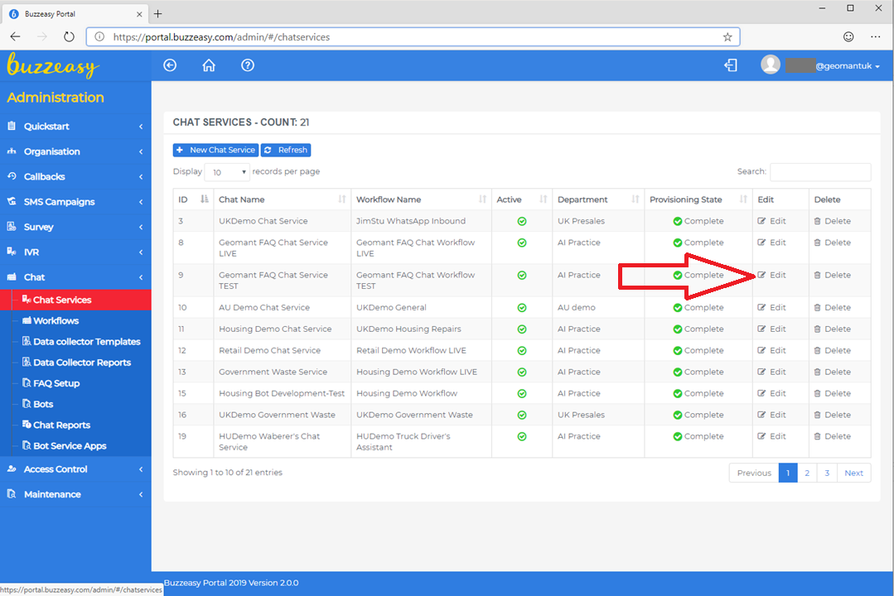
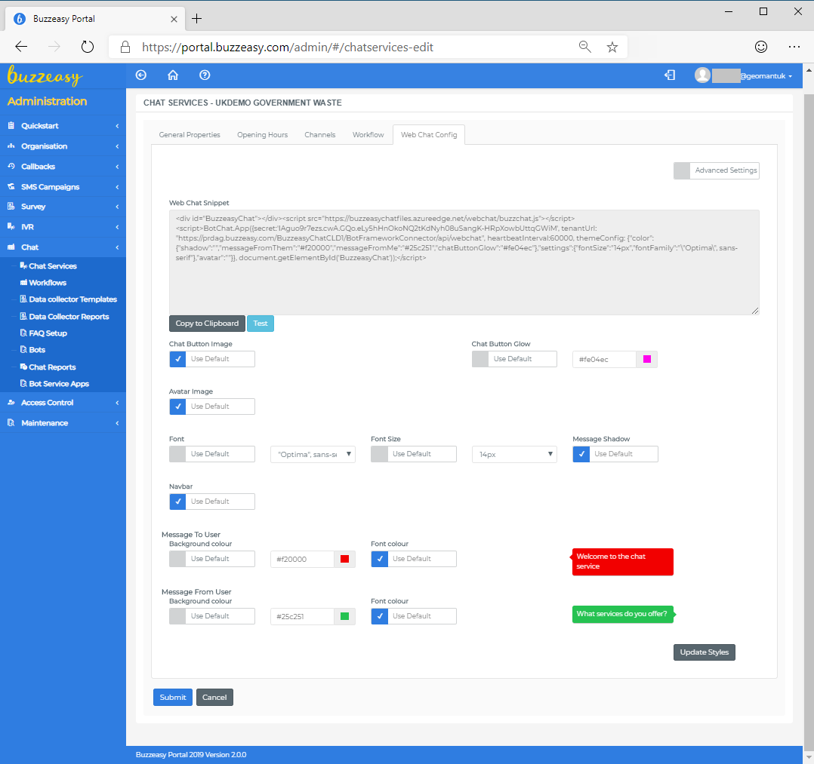

# Adding Buzzeasy Widget to the website

## Introduction

Buzzeasy provides a ready made chat widget that can be embedded into any website with few lines of JavaScript code. The widget can be customized to have a personalized look and feel of the widget that fits the style of the webpage.

## Widget Configuration

The JavaScript widget to be embedded can be generated within the Buzzeasy Portal. You need to go the the **Chat Services** page and click *Edit*.

Select **Web Chat Config** to access the configuration page.

### Web Chat Snippet

The top of the page the text box shows the code to be embedded into the website. All you need os to copy-paste this snippet within the *body* element of the HTML page. You can use the *Copy to Clipboard*. The text box is read-only the code is generated based on the settings below. You can test the settings by clicking the *Test* button that pops-out a small window with the snipped code embedded already.

All settings have a default value only those need to be configured that you want to change. To update the Snipped code, please press the *Update Styles* button on the bottom of the page.

A sample HTML page with the embedded snippet is attached:

````html
<!DOCTYPE html>
<html>
 <head>
  <title>Buzzeasy Demo</title>
 </head>
 <body>
      


    <!-- Buzzeasy Snippet Starts Here -->
        <div id="BuzzeasyChat" />
        <script src="https://buzzeasychatfiles.azureedge.net/webchat/buzzchat.js" ></script>
        <script>BotChat.App({  
           "secret":"IAgdUMMy7ezs.cwA.GQo.eLy5hF0XyoNN0tValidyh08uSangK-HRpXNeMj0SemmireGWiM",
           "tenantUrl":"https://prdag.buzzeasy.com/BuzzeasyChatDEMO/BotFrameworkConnector/api/webchat",
           "heartbeatInterval":60000,
           "themeConfig":{  
              "color":{  
                 "shadow":"",
                 "messageFromThem":"#f20000",
                 "messageFromMe":"#25c251",
                 "chatButtonGlow":"#fe04ec"
              },
              "settings":{  
                 "fontSize":"14px",
                 "fontFamily":"\"Optima\", sans-serif"
              },
              "avatar":""
           }
        }, document.getElementById('BuzzeasyChat'));</script>
    <!-- Buzzeasy Snippet Ends Here -->


 </body>
</html>
````

### Chat Button Image

The icon that appears on the webpage to indicate that the users can initiate chat. It must be a valid URL to the image and must be accessible from the internet. It can be hosted on your website or any site that is publicly accessible from your customers' browsers.

### Chat Button Glow

To raise attention a flashing flow is around the chat button image. You can use the default colour or set your own. 

>[!TIP]
>By clicking to the colour a colour picker is shown, but you can enter colour names like "tomato" or "blue", but you can also use Hex Code e.g. #CD853F or Decimal Code (R,G,B) e.g. rgb(250,128,114).


### Avatar Image

The URL to the image to be displayed as the Avatar of the Chat bot. Please note that you can configure Avatar on the Workflow level as well.

### Font

You can select from list of fonts to match the style of your website.

### Font Size

You can choose between 8-14px.

### Message Shadow

The colour of the shadow can be entered or selected.

### Navbar

The colour of the header of the chat widget can be entered or selected.

### Message To User, Message from User

You can enter or select the colour of the background and the font of the messages. You can have different one for the messages to the user for from the user.


### Advanced Settings

About *Advanced Settings* please contact your Buzzeasy professional for assistance.
