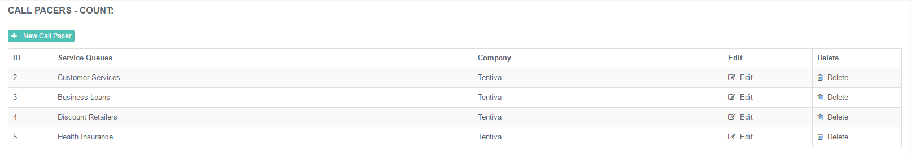
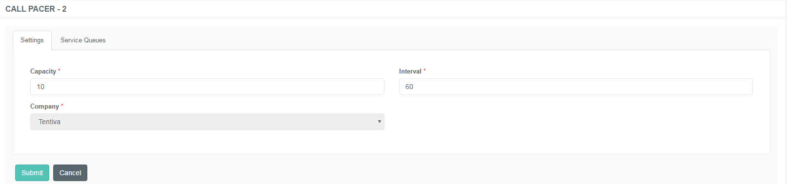
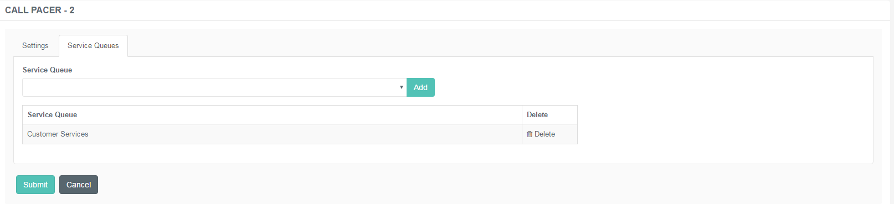

# Administration of Call Pacers

## Purpose of this Guide

This guide describes the steps of creating and maintaining call pacers
registered on the admin console.

## Call Pacers

Call pacing is an option to set to avoid a heavy flood of inbound calls
in your call center. It is possible to keep the contact center as
orderly as possible by setting the capacity of certain service queues
and to avoid an overwhelming quantity of calls on a specific service
line.

The related Service Queue(s) need to have the Schedule Call feature
enabled!

### Creating a New Call Pacer

**Creating a New Call Pacer**

1.  Navigate to ***Callbacks → Call Pacers***.  
     
2.  Use the **+New Call Pacer** button to open the new entry creation
    form.  
     
3.  Specify the details described below.  
     
4.  Click **Submit** to save the changes.

A call pacer has the following specifications:

#### Settings

|          |                                                                                                          |
|----------|----------------------------------------------------------------------------------------------------------|
| Interval | Specify the time frame within which the defined number of calls are allowed to reach the Contact Center. |
| Capacity | Specify the number of calls that are allowed to reach the Contact Center in the defined interval.        |
| Company  | Select the associated company of which owns the specific service queue.                                  |

#### Service Queues

|               |                                                                     |
|---------------|---------------------------------------------------------------------|
| Service Queue | Select the service queue that will be affected by the restrictions. |

It is possible to assign several service queues to the same pacing
options.

