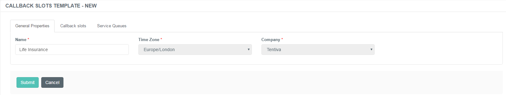
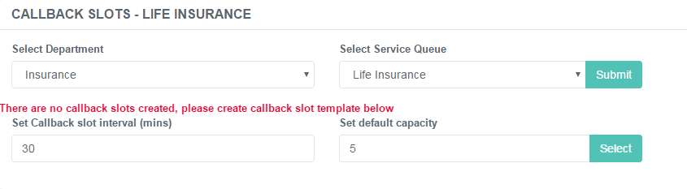
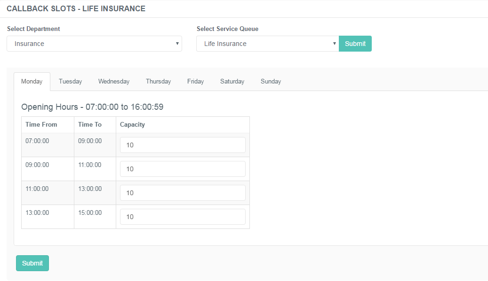

# Administration of Callback Slots

## Purpose of this Guide

This guide describes the steps of creating and maintaining the callback
slots registered on the admin console. 

## Callback Slots

A callback slot is a defined interval designated for the determination
of the operating hours of a specific company. A capacity value is
assigned to each interval which refines the operating capability of the
CC. The Opening Hours function of a Service Queue defines whether and
when a CC is open or closed, while the callback slot clarifies whether
the available capacities in that time frame are enough to handle one
more callback or not. 

Callback slots are related to the configuration of service queues - it
has relevance when requesting a scheduled callback. The IVR offers 3
callback slots based on the configuration provided on this page in case
a scheduled callback request. 

### Creating New Callback Slot Entries

Callback slots are predefined templates configured, guidelines as to how
the system should prepare the callbacks for particular companies.   
 

**Creating a New Callback Slot**

1.  Navigate to ******Callbacks*** → Callback slots***.  
     
2.  Choose the **Department** and the **Service Queue** from the
    drop-down lists for which to configure the callback slots.  
     
3.  Click ***Submit***.  
     
4.  If there are no callback slot templates added for this specific
    service queue, the system prompts with the following warning:
    -   There are no call back slots created, please create call back
        slot template below.  
5.  Enter the defined **intervals** (mins) and the **default capacity**
    that the service queue can handle at a time.  
     
6.  Click ***Submit**.  
     *
7.  The callback slots are created according to the details provided in
    step 5.  
     
8.  If successfully saved, a toaster notification will popup in the
    bottom-right corner of the screen.

|                        |                                                                                         |
|------------------------|-----------------------------------------------------------------------------------------|
| Callback Slot Interval | Specify the time frame of the callback scheduler in minutes.                            |
| Default Capacity       | Specify the number of callback requests the system will allow for the defined interval. |

 

### Relevance of Opening Hours

Consider proper Opening Hours for the Callback Slots

The proper configuration of Opening Hours is also relevant, as the
callback slots will be created according to these settings.

If a Call Center is open Monday-Friday 9 AM-7 PM, the callback slots
will be only applied to these intervals.

