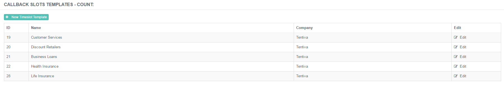
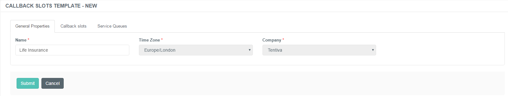
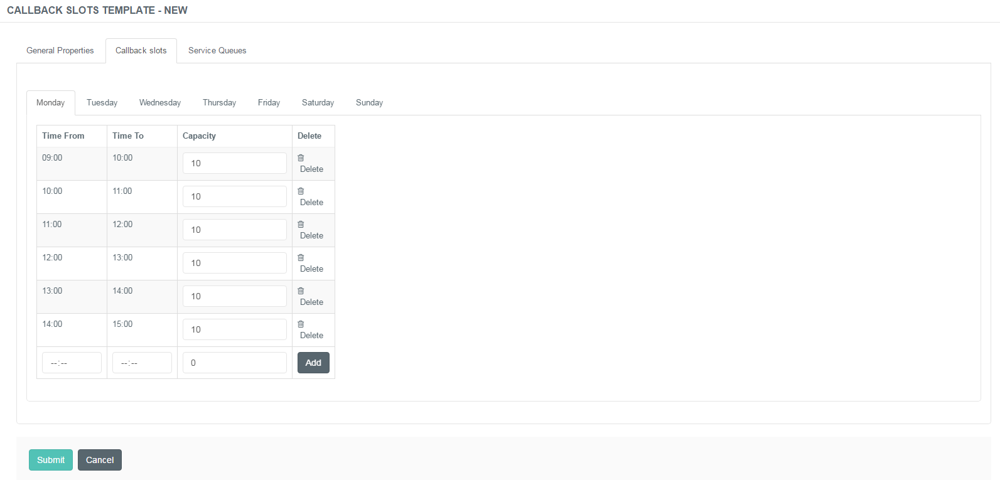
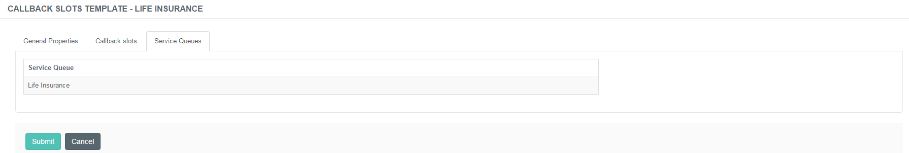
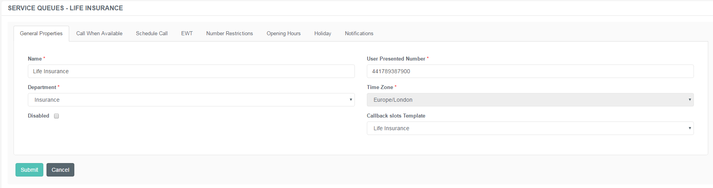

# Administration of Callback Slots 2

## Purpose of this Guide

This guide describes the steps of creating and maintaining the callback
slots registered on the admin console.

## Callback Slots

A callback slot is a defined interval designated for the determination
of the operating hours of a specific company. A capacity value is
assigned to each interval which refines the operating capability of the
CC. The Opening Hours function of a Service Queue defines whether and
when a CC is open or closed, while the callback slot clarifies whether
the available capacities in that time frame are enough to handle one
more callback or not.

Callback slots are related to the configuration of service queues - it
has relevance when requesting a scheduled callback. The IVR offers 3
callback slots based on the configuration provided on this page in case
a scheduled callback request.

### Creating New Callback Slot Entries

Callback slots are predefined templates configured, guidelines as to how
the system should prepare the callbacks for particular companies.

**Creating a New Callback Slot**

1.  Navigate to ******Callbacks*** → Callback slots***.  
     
2.  Use the +New Timeslot Template to open the entry form.  
     
3.  Specify the details described below.  
     
4.  Click ***Submit***.

#### General Properties Tab

|           |                                                                |
|-----------|----------------------------------------------------------------|
| Name      | Specify the name of the time-slot template.                    |
| Time Zone | Select the timezone associated with the related service queue. |
| Company   | Select the associated company.                                 |

#### Callback Slots Tab

This tab represents the time-slot templates that can be set according to
the related Service Queue's business hours.

<table>
<colgroup>
<col style="width: 50%" />
<col style="width: 50%" />
</colgroup>
<tbody>
<tr class="odd">
<td>Time From</td>
<td>Set the start of the opening hours to generate the slots according to it.</td>
</tr>
<tr class="even">
<td>Time To</td>
<td>Set the end of the opening hours to generate the slots according to it.</td>
</tr>
<tr class="odd">
<td>Set Callback Slot Interval (mins)</td>
<td>
Specify the time frame of the callback scheduler in minutes.

If there are no callback slot templates added for this specific service queue, the system prompts with the following warning: There are no call back slots created, please create call back slot template below.

</td>
</tr>
<tr class="even">
<td>Set Default Capacity</td>
<td>Specify the number of callback requests the system will allow for the defined interval.</td>
</tr>
</tbody>
</table>

The timeslots can be deleted manually after generating the template.

#### Service Queues

The list of associated service queues is displayed here.

Service Queues can be attached to the timeslots in the related Service
Queue's 'Schedule Call' tab.

**Assigining Callback Slots to Service Queues**

1.  Navigate to the ***Callbacks → Service Queues*** list.  
     
2.  Select *Edit* of the preferred Service Queue.  
     
3.  Select the related time-slot template entry from the ***Callback
    Slots Template*** drop-down list.  
     
4.  Click **Submit**.

### Relevance of Opening Hours

Consider proper Opening Hours for the Callback Slots

The proper configuration of Opening Hours is also relevant, as the
callback slots will be created according to these settings.

If a Call Center is open Monday-Friday 9 AM-7 PM, the callback slots
will be only applied to these intervals.