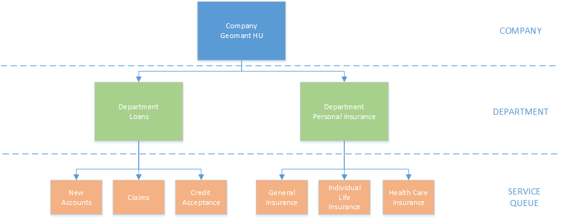
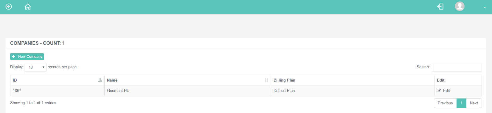
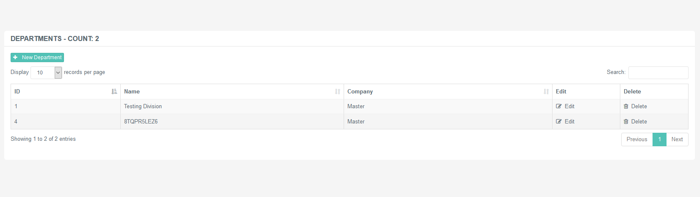
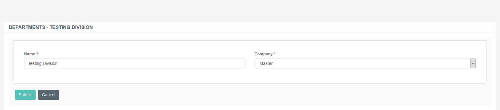

# Administration of Companies and Departments

## Purpose of this Guide

This guide describes the steps on creating and maintaining the list of
companies and departments. 

### Organisational Hierarchy

The diagram on the right displays the tiers of the different segments of
an example organisation and the way they connect to each other. 

|                |                                                                                                                                        |
|----------------|----------------------------------------------------------------------------------------------------------------------------------------|
| Company        | The top node is the company itself, also referred to as the 'customer'. It is top tier of the organisational hierarchy.                |
| Departments    | The company defines a number of departments dealing with a specific area of business activity. These units are called ' departments '. |
| Service Queues | The service queue is the actual queue on which the callback requests are performed.                                                    |

### Companies

A company is the customer requesting the callback services via Buzzeasy.
It must be the top in the hierarchy of organisations. 

Geomant Personnel handles Company Creation

Please note that the maintenance of a Company entry is handled by
Geomant Personnel only.

### Departments

A department is a business section of a particular company, and usually
deal with a specific area of activity. It allows the customer (company)
to divide and separate their units into departments. Such sections are
Sales, Accounting or Customer Service, for example. 

Departments are second in line of the organisational hierarchy (Tier
2). 

This page displays the list of existing departments registered in the
system. 

Available Features are dependent on User Roles

Possible actions to take are dependent on the role assigned to a
specific user account.

Deletion is Disabled

Please note that deletion of a department entry causes the loss of
historical callback data related to the service queues or phone numbers
associated with it, therefore it is not allowed to perform under any
circumstances.

#### Creating a New Department

Follow the steps described below in order to create new department
entries.

**Creating a New Department**

1.  Navigate to ***Organisation → Departments***.  
2.  Click on the +New Department button in order to create a new
    department entry.  
3.  Fill in the details described below.  

    -   Name: Specify the name of the department that will receive the
        calls.

    -   Company: Choose the company related to the department .

4.  Click ***Submit*** to save the new item.

Editing

Use the ***Edit*** button to modify an existing item.

## Attachments:

[2.5\_companies\_list.PNG](attachments/12715197/12715198.png)
(image/png)  

[2.5\_new\_company\_entry.PNG](attachments/12715197/12715199.png)
(image/png)  

[departments\_list.PNG](attachments/12715197/12715200.png) (image/png)  

[hierierarchy\_buzzeasy.png](attachments/12715197/12715201.png)
(image/png)  

[new\_department.PNG](attachments/12715197/12715202.png) (image/png)  
