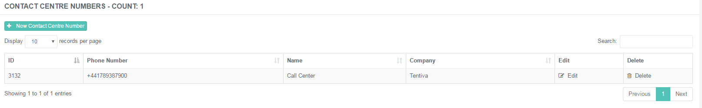
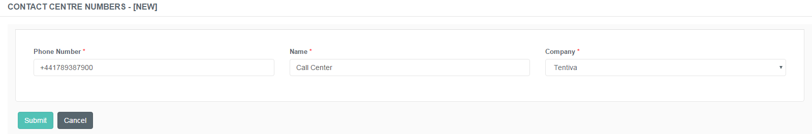

# Administration of Contact Centre Numbers

## Purpose of this Guide

This guide describes the steps of creating and maintaining the phone
numbers related to the different service queues.

## Contact Centre Numbers

A Contact Centre Number is a phone number which is associated with a
specific service queue. Customers will receive the callbacks from this
number regarding their inquiry or existing case if they registered a
callback request in the particular queue. 

This page displays a list of existing contact centre numbers registered
in the system. 

Available Features are dependent on User Roles

Possible actions to take are dependent on the role assigned to a
specific user account.

Deletion and Editing are Disabled

Please note that editing and deletion of a phone number entry causes the
loss of related historical callback data, therefore both editing and
deletion are disabled by design.

### Creating a New Contact Centre Number

Follow the steps described below in order to create a new contact centre
number.

**Creating a New Contact Centre Number**

1.  Navigate to Callbacks ***→ Contact Centre Numbers***.  
     

2.  Click on the **+New Contact Centre Number** button in order to
    create a phone number entry for a specific service queue.   
     

3.  Fill in the details described below.  
     

    -   **Phone Number**: Specify the phone number of the queue that
        will receive the calls. It must start with '+' and the
        international country code.

    -   **Name**: Specify a unique designation of the phone number.

    -   **Company**: Choose the company related to the phone number.  
         

4.  Click ***Submit* **to save the new item.

