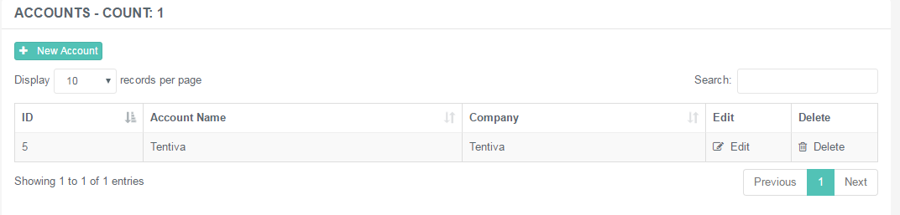
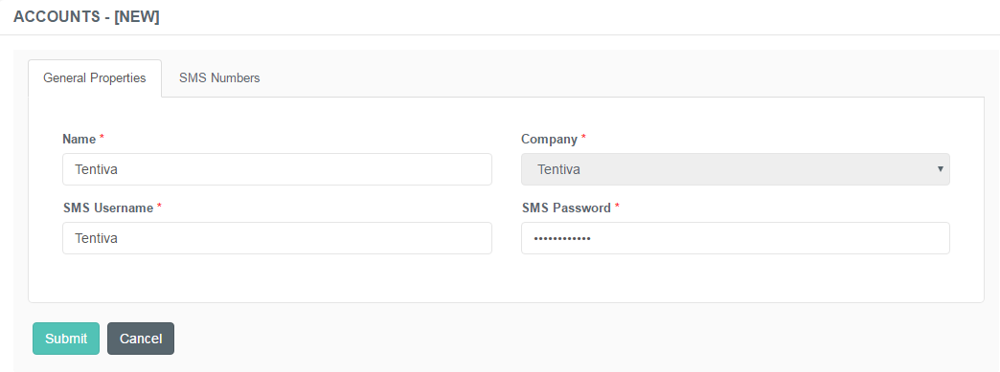
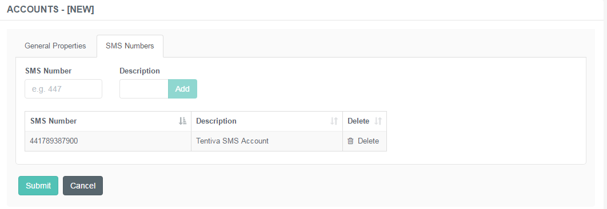

# Administration of SMS Accounts

## Purpose of This Guide

This guide describes the steps of management of the SMS accounts.

 

## SMS Account

This menu represents the list of SMS accounts for the different
customers.

The significance of creating the different accounts is to get the
billing isolated, so we get the bill per customer according to their
consumption.

### Creating a New SMS Account

**Creating a New SMS Account**

1.  Navigate to ***SMS Campaigns → Accounts***.  
     
2.  Use the **+New SMS Account** button to create a new entry.  
     
3.  Specify the details described below.  
     
4.  Click ***Submit*** to save the entry.

 

#### General Properties

An SMS Account has the following details:

|              |                                                                                      |
|--------------|--------------------------------------------------------------------------------------|
| Name         | Specify the account's unique designation.                                            |
| Company      | Choose the associated company from the drop-down list.                               |
| SMS Username | Enter the username of the account that is provided by the SMS Provider.              |
| SMS Password | Enter the password associated with the account that is provided by the SMS Provider. |

#### SMS Numbers

Here you can manage the related DLNs and short codes registered for a
particular company.

|             |                                                             |
|-------------|-------------------------------------------------------------|
| SMS Number  | Specify the SMS numbers given by the service provider.      |
| Description | Add a short description or note about the specified number. |

Annotation of phone numbers

**DLN** stands for Dedicated Long Number, which is basically the full
telephone number.

**Short code** is a special telephone number which is significantly
shorter than the usual phone numbers. These are used for value added
services, such as donations, ordering or voting. However, the billing
rate is higher than the usual pricing.

There can be more than one DLN associated with a particular account.

