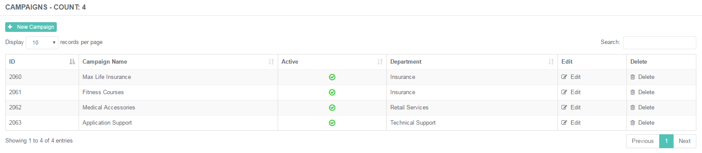
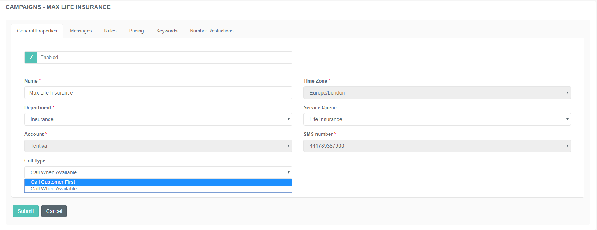
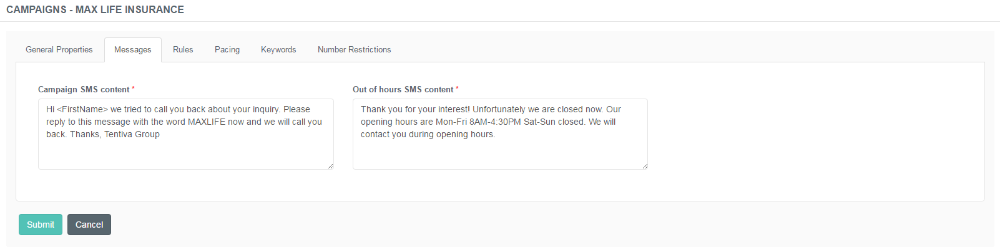
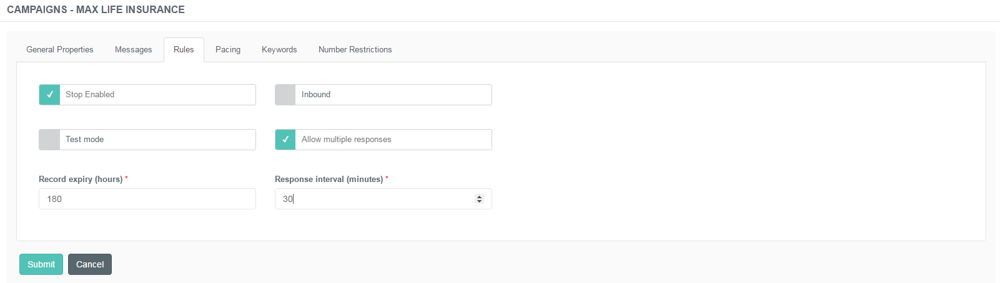
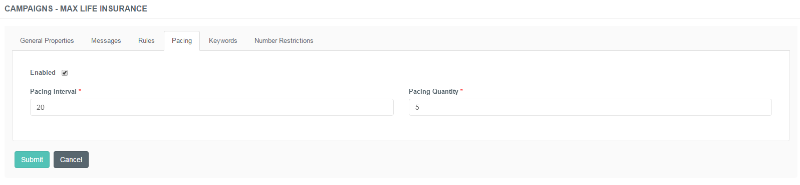
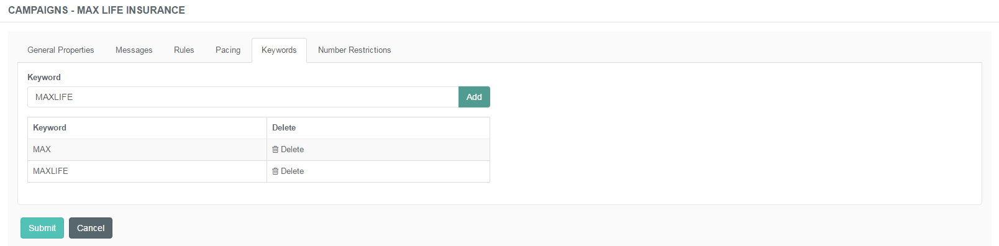
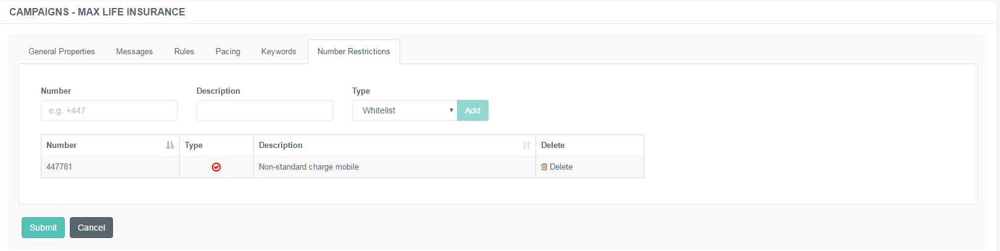

# Administration of SMS Campaigns

## Purpose of This Guide

This guide describes the steps of creating and maintaining the list of
SMS Campaigns using the admin portal.

## SMS Campaigns

Outbound SMS campaigns offer queue-less callback requests to customers
by simply sending a text message. Recipients have the chance to request
a personal callback by replying with the keyword specified in the SMS.

SMS Campaigns can be assigned to existing SMS Accounts and Service
Queues.

### Creating a New SMS Campaign

The license could not be verified: License Certificate has expired!

**Creating a New Campaign**

1.  Navigate to ***SMS Campaigns → Campaigns***.  
     
2.  Use the **+New Campaign** button to create new entries.  
     
3.  Specify the details described below.  
     
4.  Click ***Submit*** to save the entry.

#### General Properties Tab

This tab represents the basic details of the SMS campaign itself. 

Specify the following details:

|                       |                                                                                                                                                           |
|-----------------------|-----------------------------------------------------------------------------------------------------------------------------------------------------------|
| Enable/Disable Option | Use this button to enable or disable the feature in a single click.                                                                                       |
| Name                  | Specify the unique designation of the campaign.                                                                                                           |
| Time Zone             | Choose the appropriate time zone from the drop-down list.                                                                                                 |
| Department            | Choose the division associated with the newly created campaign.                                                                                           |
| Service Queue         | Choose the service queue associated with the newly created campaign. Service Queues are the ones related to the particular department.                    |
| Account               | Choose which provider to use.                                                                                                                             |
| SMS Number            | Specify the number used to send short messages.                                                                                                           |
| Call Type             | Select the type of request to register in case of an SMS is received successfully. Available options are *Call Customer First* and *Call When Available*. |

#### Messages Tab

This tab represents the content of the short messages. Here you can
create the text that are sent to customers via the SMS.

|                          |                                                                                                                                     |
|--------------------------|-------------------------------------------------------------------------------------------------------------------------------------|
| Campaign SMS Content     | Type the text of the short message. Include the keyword that the customer has to send in response in order to trigger the callback. |
| Out of Hours SMS Content | Type the text of the short message that is sent in response to the customer's message if received during out of business hours.     |

#### Rules Tab

This tab represents the Rules function. Here you can set how the actual
campaign should behave in certain scenarios.

The following rules can be applied for a particular campaign:

|                          |                                                                                                                                                                                                                 |
|--------------------------|-----------------------------------------------------------------------------------------------------------------------------------------------------------------------------------------------------------------|
| Stop Enabled             | If the word 'STOP' is included in a response, the sender's number will be added to the Blacklist. The word 'STOP' terminates the specific service.                                                              |
| Inbound                  | If the keyword is broadcast (on a website, for example) customers can send it in a text message, thus requesting a callback.                                                                                    |
| Test Mode                | Enable this function if you run the campaign in a test mode, which will eventually turn off duplication checks.                                                                                                 |
| Allow Multiple Responses | This is a hybrid mode of inbound and outbound. It is possible to receive multiple responses from the same number and process them in a proper manner.                                                           |
| Response Interval (mins) | This function appears if the 'Allow Multiple Responses' mode is enabled. The interval refers to the delay between two responses. Set the interval in minutes to wait before the next response can be processed. |
| Record Expiry (hours)    | Set the expiration time for a particular record.                                                                                                                                                                |

#### Pacing Tab

This tab represents the Pacing function. Pacing means to review several
inbound messages and send a batch of response messages at once in a
given interval.

|                 |                                                                           |
|-----------------|---------------------------------------------------------------------------|
| Enabled         | Check this box to activate the function.                                  |
| Pacing Interval | Specify the time frame within which the batch of messages should be sent. |
| Pacing Quantity | Specify the number of messages to be sent.                                |

If this function is disabled, the system sends 1 SMS at a time.

#### Keywords

This tab represents the list of Keywords sent in short messages. Here
you can manage and maintain the buzzwords used to trigger the callbacks.

#### Number Restrictions

This tab represents the Number Restrictions function. Here you can
manage the numbers that are either allowed or blocked to receive a call
from or initiate a call to the CC. In other words, it is possible to
create a Whitelist and a Blacklist from here.

|             |                                                                                                             |
|-------------|-------------------------------------------------------------------------------------------------------------|
| Number      | Specify the particular number to be added to the list of restrictions.                                      |
| Description | Add a note to it to be easily differentiated from the rest of the numbers.                                  |
| Type        | Choose the type of the restriction from the drop-down list. There are two choices: Whitelist and Blacklist. |

