# Administration of Service Queues

## Purpose of this Guide

This guide describes the steps of creating and maintaining the service
queues registered on the admin console. 

## Service Queues

A Service Queue is a phone line dedicated to a specific business within
a division. It involves the configuration of the related phone numbers
and setup of associated call rules. 

This page displays a list of existing service queues registered in the
system. 

Available Features are dependent on User Roles

Possible actions to take are dependent on the role assigned to a
specific user account.

Deletion of Service Queues is Disabled

**Please note that deletion of a service queue is not allowed as it can
cause the loss of related historical callback data.**

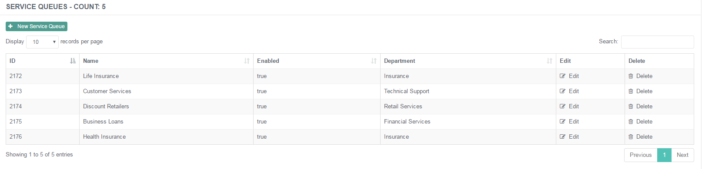

### Creating a New Service Queue

**Creating a New Service Queue**

1.  Navigate to ***Callbacks → Service Queues***.  
     
2.  Click on the **+New Service Queue **button in order to create a new
    service queue entry.  
     
3.  Fill in the details described below.  
     
4.  Click ***Submit* **to save the new item.

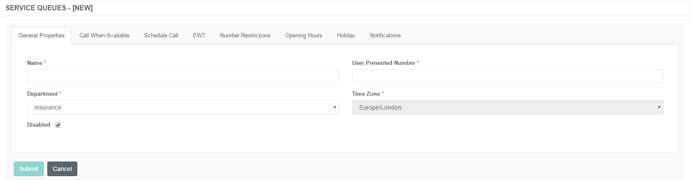

#### General Properties Tab

This tab represents the basic details of the service queue itself. 

Specify the following details:

|                       |                                                                                     |
|-----------------------|-------------------------------------------------------------------------------------|
| Name                  | Specify the unique designation of the service queue.                                |
| User Presented Number | Specify the number that will be visible to the user when the callback is performed. |
| Department            | Specify the division associated with the newly created service queue.               |
| Time Zone             | Choose the appropriate time zone from the drop-down list.                           |
| Disabled              | Check this box to inactivate the service queue altogether.                          |

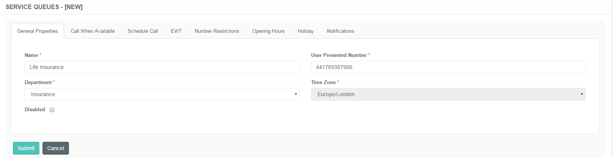

#### Call When Available Tab

This tab represents the Call When Available function. If enabled, the
customer calling a specific line - that is unavailable at the time of
the call - has the option to request a callback as soon as an agent
becomes available. Buzzeasy will dial the contact centre when the
request is sent through the IVR, and after reaching a free operator, it
will start the callback immediately. 

Specify the following details:

|                                                |                                                                                                                                                                                                                                                                                                                                                                         |
|------------------------------------------------|-------------------------------------------------------------------------------------------------------------------------------------------------------------------------------------------------------------------------------------------------------------------------------------------------------------------------------------------------------------------------|
| Disabled                                       | The feature is Disabled by design. Checking this box enables this function and expands the menu.                                                                                                                                                                                                                                                                        |
| Contact Centre Numbers                         | Choose the phone number associated with the service queue. This number will handle the call and be presented to the customer.                                                                                                                                                                                                                                           |
| Retry Attempts                                 | Specify the number of times the system should dial the customer again in case of unavailability.                                                                                                                                                                                                                                                                        |
| Retry Intervals (sec)                          | Specify the time interval in seconds to wait between two dialling attempts.                                                                                                                                                                                                                                                                                             |
| Retry Timeout (sec)                            | Specify the time interval in seconds a callback should last.                                                                                                                                                                                                                                                                                                            |
| Agent Whisper Rule                             | Check this box to enable agent whisper function. The function announces certain information to the agent on the callback before the dialling the client.                                                                                                                                                                                                                |
| Agent Whisper Message                          | Specify what details to announce to the agent if this function is enabled. Field and name references should be placed between angle brackets \<\>. Curly brackets { }, should then be placed outside of the angle brackets, to denote that this is a recording. For instance, if the customer is asked to record their name, the field reference would be {\<Field1\>}. |
| Allow Customer CLI Passthrough                 | Check this box to enable presenting the customer's line identifier on the call to the CC instead of using the CLI registered in Buzzeasy.                                                                                                                                                                                                                               |
| Enable DTMF playing in queue                   | This enables Buzzeasy to play a specified value for different purposes, such as requesting a callback that goes straight to a specified agent.                                                                                                                                                                                                                          |
| DTMF Value                                     | Specify the value to be played in the queue while waiting to get to an agent.                                                                                                                                                                                                                                                                                           |
| DTMF Delay                                     | Specify the interval in seconds to wait before playing the DTMF value.                                                                                                                                                                                                                                                                                                  |
| Enable Follow-up Campaign on Failed Callbacks? | Check this box to enable offering callback requests in text messages to the customers in case of failed calls.                                                                                                                                                                                                                                                          |
| Campaign                                       | Select the campaign from which text messages are sent to customers in case of failed calls.                                                                                                                                                                                                                                                                             |

If the Failure Campaign is enabled and active, it will use the details
specified in the related SMS Campaign that is associated with the
Service Queue. Read more about the settings in the [SMS
Campaigns](Administration_of_SMS_Campaigns.md)
article.

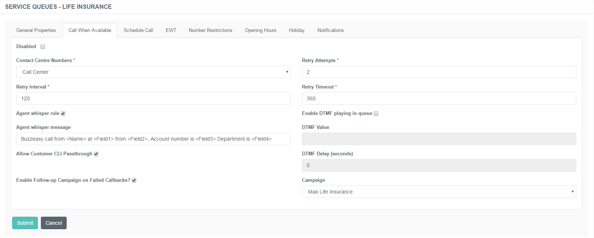

#### Call Customer First Tab

This tab represents the Call Customer First function. If enabled, the
system queues the end customer in a priority queue of the contact centre
and connect them. End customer's data are transmitted to the contact
centre agent if the callback was requested from within the company's
website or mobile application.

|                                                |                                                                                                                                           |
|------------------------------------------------|-------------------------------------------------------------------------------------------------------------------------------------------|
| Disabled                                       | The feature is Disabled by design. Checking this box enables this function and expands the menu.                                          |
| Contact Centre Numbers                         | Choose the phone number associated with the service queue. This number will handle the call and be presented to the customer.             |
| Retry Attempts                                 | Specify the number of times the system should dial the customer again in case of unavailability.                                          |
| Retry Intervals (sec)                          | Specify the time interval in seconds to wait between two dialling attempts.                                                               |
| Retry Timeout (sec)                            | Specify the time interval in seconds a callback should last.                                                                              |
| Voicemail Rule                                 | Select the type of voicemail rule to perform in case where the Buzzeasy call connected to a VM instead of the contact.                    |
| Voicemail Message                              | Enter the text for the TTS message to play when the Buzzeasy call got connected to the VM of the contact.                                 |
| Allow Customer CLI Passthrough                 | Check this box to enable presenting the customer's line identifier on the call to the CC instead of using the CLI registered in Buzzeasy. |
| Enable Follow-up Campaign on Failed Callbacks? | Check this box to enable offering callback requests in text messages to the customers in case of failed calls.                            |
| Campaign                                       | Select the campaign from which text messages are sent to customers in case of failed calls.                                               |

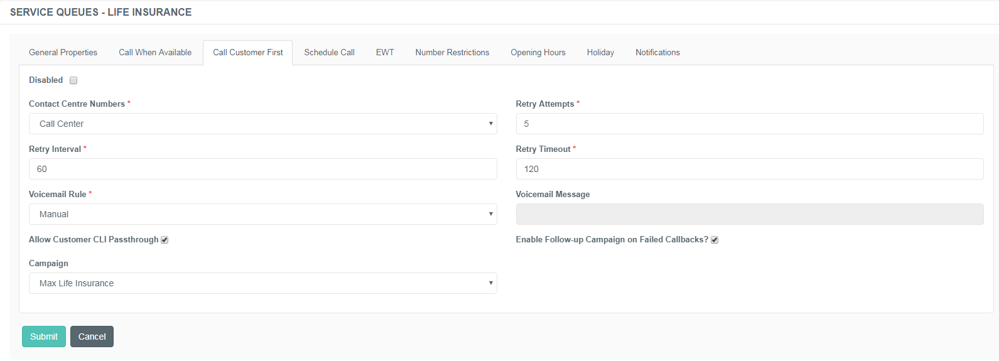

#### Schedule Call Tab

This tab represents a Schedule Callback option. If enabled, the customer
calling a specific line - that is unavailable at the time of the call -
has the option to request a callback for a preferred time. The IVR
offers 3 time slots - the closest 3 to the time of the call according to
the time slots and opening hours defined in the admin portal. 

Specify the following details:

|                                                |                                                                                                                                                |
|------------------------------------------------|------------------------------------------------------------------------------------------------------------------------------------------------|
| Disabled                                       | The feature is Disabled by design. Checking this box enables this function and expands the menu.                                               |
| Contact Centre Numbers                         | Choose the phone number associated with the service queue. This number will handle the call and be presented to the customer.                  |
| Retry Attempts                                 | Specify the number of times the system should dial the customer again in case of unavailability.                                               |
| Retry Intervals                                | Specify the time interval to wait between two dialling attempts.                                                                               |
| Retry Timeout                                  | Specify the time interval a callback should last.                                                                                              |
| Agent Whisper Rule                             | Check this box to enable agent whisper function.                                                                                               |
| Agent Whisper Message                          | Specify what to whisper to the agent if this function is enabled.                                                                              |
| Allow Customer CLI Passthrough                 | Check this box to enable presenting the customer's line identifier on the call to the CC instead of using the CLI registered in Buzzeasy.      |
| Enable DTMF playing in queue                   | This enables Buzzeasy to play a specified value for different purposes, such as requesting a callback that goes straight to a specified agent. |
| DTMF Value                                     | Specify the value to be played in the queue while waiting to get to an agent.                                                                  |
| DTMF Delay                                     | Specify the interval in seconds to wait before playing the DTMF value.                                                                         |
| Enable Follow-up Campaign on Failed Callbacks? | Check this box to enable offering callback requests in text messages to the customers in case of failed calls.                                 |
| Campaign                                       | Select the campaign from which text messages are sent to customers in case of failed calls.                                                    |

Callback Slots Administration

Please read the following article on creating time slots:
[Administration of Callback Slots](Administration_of_Callback_Slots.md)

If the Failure Campaign is enabled and active, it will use the details
specified in the related SMS Campaign that is associated with the
Service Queue. Read more about the settings in the [SMS
Campaigns](Administration_of_SMS_Campaigns.md)
article.

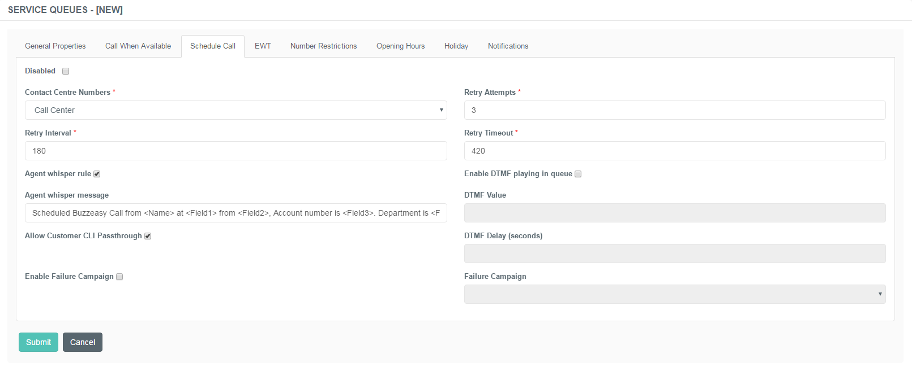

##### Examples

**Scenario 1**: customer calls the CC at 3 PM. The time-slots are
defined in hourly intervals for this specific company and the opening
hours are set to 9 AM - 7 PM. The IVR will offer the following options:
4 PM, 5 PM and 6 PM. 

**Scenario 2**: customer calls the CC at 3 PM. The time-slots are
defined in 30 minute intervals for this specific company and the opening
hours are set to 9 AM - 7 PM. The IVR will offer the following options:
4 PM, 4:30 PM and 5 PM. 

**Scenario 3**: customer calls the CC at 4 PM. The time-slots are
defined in hourly intervals for this specific company and the opening
hours are set to 9 AM - 6 PM. The IVR will offer the following options:
5 PM, 9 AM and 10 AM the next day. 

#### EWT Call Tab

This tab represents the *EWT* Call function. ***EWT*** stands for
***Estimated Wait Time***. It measures the time in which a customer can
get to an agent. The measurement is based on historical data. 

The feature is not enabled for editing at the moment.

Specify the following details:

|                                                |                                                                                                                                                |
|------------------------------------------------|------------------------------------------------------------------------------------------------------------------------------------------------|
| Disabled                                       | The feature is Disabled by design. Checking this box enables this function and expands the menu.                                               |
| Contact Centre Numbers                         | Choose the phone number associated with the service queue. This number will handle the call and be presented to the customer.                  |
| Retry Attempts                                 | Specify the number of times the system should dial the customer again in case of unavailability.                                               |
| Retry Intervals                                | Specify the time interval to wait between two dialling attempts.                                                                               |
| Retry Timeout                                  | Specify the time interval a callback should last.                                                                                              |
| Agent Whisper Rule                             | Check this box to enable agent whisper function.                                                                                               |
| Agent Whisper Message                          | Specify what to whisper to the agent if this function is enabled.                                                                              |
| Allow Customer CLI Passthrough                 | Check this box to enable presenting the customer's line identifier on the call to the CC instead of using the CLI registered in Buzzeasy.      |
| Enable DTMF playing in queue                   | This enables Buzzeasy to play a specified value for different purposes, such as requesting a callback that goes straight to a specified agent. |
| DTMF Value                                     | Specify the value to be played in the queue while waiting to get to an agent.                                                                  |
| DTMF Delay                                     | Specify the interval in seconds to wait before playing the DTMF value.                                                                         |
| Enable Follow-up Campaign on Failed Callbacks? | Check this box to enable offering callback requests in text messages to the customers in case of failed calls.                                 |
| Campaign                                       | Select the campaign from which text messages are sent to customers in case of failed calls.                                                    |

If the Failure Campaign is enabled and active, it will use the details
specified in the related SMS Campaign that is associated with the
Service Queue. Read more about the settings in the [SMS
Campaigns](Administration_of_SMS_Campaigns.md)
article.

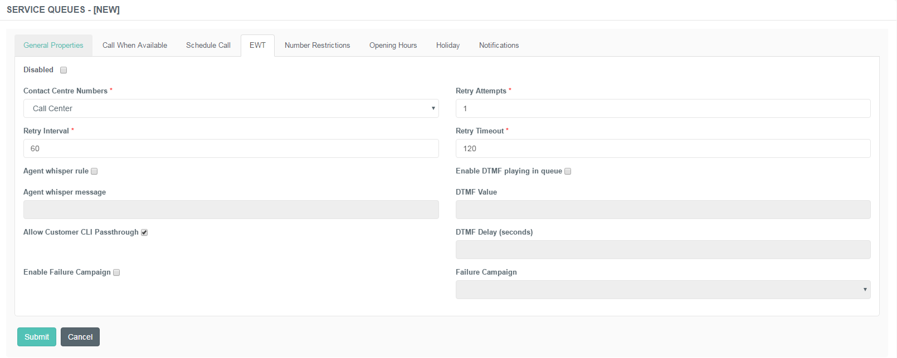

#### Number Restrictions Tab

This tab represents the *Number Restrictions* function. Here you can
manage the numbers that are either allowed or blocked to receive a call
from or initiate a call to the CC. In other words, it is possible to
create a Whitelist and a blacklist from here. 

|             |                                                                                                                                                       |
|-------------|-------------------------------------------------------------------------------------------------------------------------------------------------------|
| Number      | Specify the particular number to be added to the list of restrictions.                                                                                |
| Description | Add a note to it to be easily differentiated from the rest of the numbers. For example, the customer's name. However, this is not a compulsory field. |
| Type        | Choose the type of the restriction from the drop-down list. There are two choices: Whitelist and Blacklist.                                           |

The list of existing numbers is also visible on this page. 

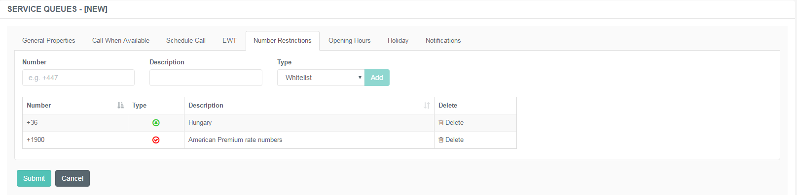

#### Opening Hours Tab

This tab represents the *Opening hours* function. Here you can manage
the opening hours related to the specific company. 

The time intervals can be set manually by adjusting it with the sliders.

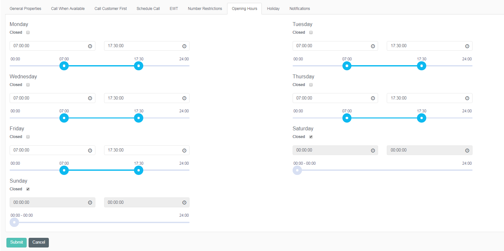

**Setting Predefined Opening Hours**

Click the **Create Default Entries** button in order to set up
predefined opening hours.

This button provides the ability to define the business hours day by
day.

Closed Checkbox

You can easily close the call centre on a particular day by ticking the
**Closed** checkbox.

00:00:00 - 00:00:00 means Closed

Please note that a '00:00:00 - 00:00:00' entry is interpreted as
"closed" by the system, even though the **Closed** check box might not
be selected.

 

#### Holidays Tab

This tab represents the *holiday settings* function. Here you can manage
and preset the date and time of the public holidays or other occasions
when the call centre is operating in different business hours or is
closed. 

Specify the following details:

|            |                                                                                                                  |
|------------|------------------------------------------------------------------------------------------------------------------|
| Date       | Choose the date of the specific holiday using the date picker.                                                   |
| Open       | Choose if the CC would be closed or open on this day.                                                            |
| Open Time  | Set the start date of the holiday. This menu expands if the Open type is set to *Open*.                          |
| Close Time | Set the end date of the holiday. This menu expands if the Open type is set to *Open*.                            |
| Comments   | Add a note to it to be easily differentiated from the rest of the entries. For example, the name of the holiday. |

The list of existing holiday items is also visible on this page. 

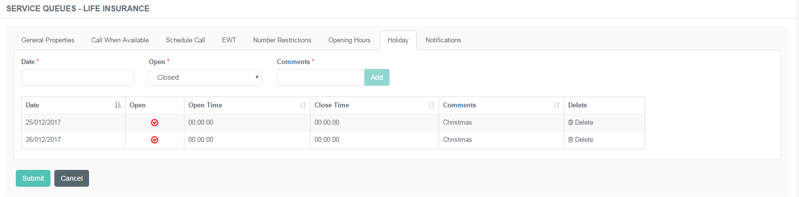

#### Notifications

This tab represents the *notifications* function which contains certain
notification methods for failed calls and SMS reminders of callback
requests.

|                           |                                                                                                                         |
|---------------------------|-------------------------------------------------------------------------------------------------------------------------|
| Enable Email Notification | Activating this feature will send automated emails to the Contact Center members in case of failed client calls.        |
| Email Group               | Select the email groups associated with the feature.                                                                    |
| Enable SMS Reminder       | Activating this feature will send reminder messages of callback requests to the clients via SMS:                        |
| SMS Reminder Interval     | Set the interval in minutes to send the text message before the callback.                                               |
| Enable SMS Confirmation   | SMS confirmation of the call during which the callback has been scheduled including the time of the scheduled callback. |

The [Email Groups](Email_Groups.md) article includes information on how to
create and manage the email groups that will receive the notification in
your Contact Center.

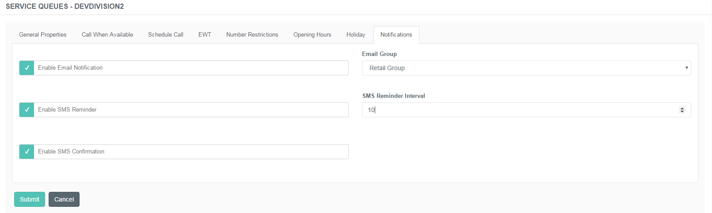