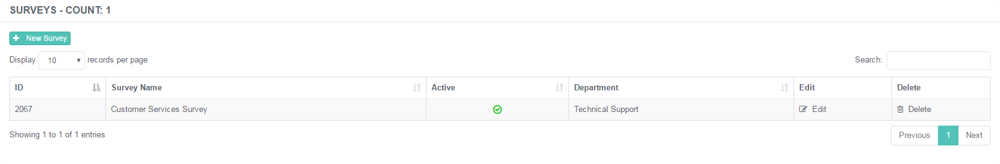
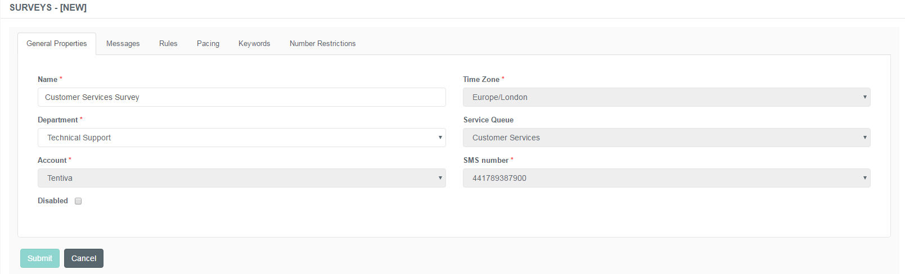
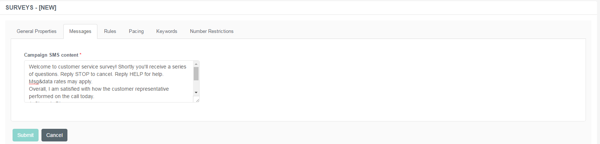
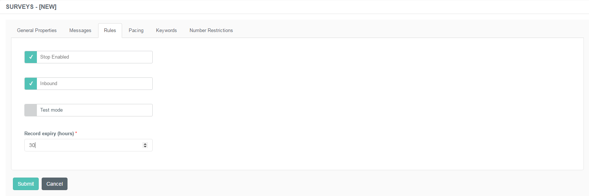
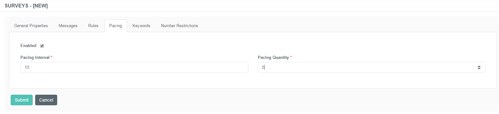
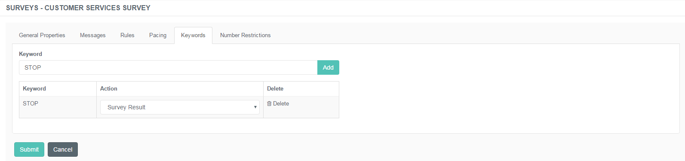
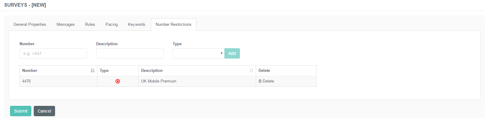

# Administration of Surveys

## Purpose of This Guide

This guide describes the steps of creating and maintaining the list of
surveys using the admin portal.

 

## Surveys

The text message survey allows you to create an interactive way of
customer evaluation. It enables the customers to provide feedback and
share their opinions via mobile phones.

### Creating a New Survey

**Creation of Surveys**

1.  Navigate to ***Survey → Surveys***.  
     
2.  Use the **+New Survey** button to create new entries.  
     
3.  Specify the details described below.  
     
4.  Click ***Submit*** to save the entry.

#### General Properties Tab

This tab represents the basic details of the survey itself.

Specify the following details:

<table>
<colgroup>
<col style="width: 50%" />
<col style="width: 50%" />
</colgroup>
<tbody>
<tr class="odd">
<td>Name</td>
<td>Specify the unique designation of the survey.</td>
</tr>
<tr class="even">
<td>Time Zone</td>
<td>Choose the appropriate time zone from the drop-down list.</td>
</tr>
<tr class="odd">
<td>Department</td>
<td>Choose the division associated with the newly created survey.</td>
</tr>
<tr class="even">
<td>Service Queue</td>
<td>Choose the service queue associated with the newly created survey. Service Queues are the ones related to the particular department.</td>
</tr>
<tr class="odd">
<td>Account</td>
<td>Choose which provider to use.</td>
</tr>
<tr class="even">
<td>SMS Number</td>
<td>Specify the number used to send short messages.</td>
</tr>
<tr class="odd">
<td>Disabled</td>
<td>
Check this box to inactivate the survey mode altogether.

Please note that the new entry is disabled by design. You have to enable it to make it work.

</td>
</tr>
</tbody>
</table>

#### Messages Tab

This tab represents the content of the short messages which will be sent
to request either to fill in a survey quest or to have a callback. Here
you can create the text that are sent to customers via SMS.

|                      |                                                                                                                                |
|----------------------|--------------------------------------------------------------------------------------------------------------------------------|
| Campaign SMS Content | Type the text of the short message. Include the keyword to send back with the response in order to trigger the related action. |

#### Rules Tab

This tab represents the Rules function. Here you can set how the survey
should behave in certain scenarios.

The following rules can be applied for a particular campaign:

|                       |                                                                                                                                                    |
|-----------------------|----------------------------------------------------------------------------------------------------------------------------------------------------|
| Stop Enabled          | If the word 'STOP' is included in a response, the sender's number will be added to the Blacklist. The word 'STOP' terminates the specific service. |
| Inbound               | If the keyword is broadcast (on a website, for example) customers can send it in a text message, thus requesting a callback.                       |
| Test Mode             | Enable this function if you run the survey in test mode, which will eventually turn off duplication checks.                                        |
| Record Expiry (hours) | Set the expiration time for a particular record.                                                                                                   |

#### Pacing Tab

This tab represents the Pacing function. Pacing means to review several
inbound messages and send a batch of response messages at once in a
given interval.

|                 |                                                                           |
|-----------------|---------------------------------------------------------------------------|
| Enabled         | Check this box to activate the function.                                  |
| Pacing Interval | Specify the time frame within which the batch of messages should be sent. |
| Pacing Quantity | Specify the number of messages to be sent.                                |

If this function is disabled, the system sends 1 SMS at a time.

#### Keywords Tab

This tab represents the list of Keywords sent in short messages, and can
also be sent back by the customers. Here you can manage and maintain the
buzzwords used to trigger certain actions.

 

#### Number Restrictions

This tab represents the Number Restrictions function. Here you can
manage the numbers that are either allowed or blocked to receive a
response from or initiate a text message to the CC. In other words, it
is possible to create a Whitelist and a Blacklist from here.

 

|             |                                                                                                             |
|-------------|-------------------------------------------------------------------------------------------------------------|
| Number      | Specify the particular number to be added to the list of restrictions.                                      |
| Description | Add a note to it to be easily differentiated from the rest of the numbers.                                  |
| Type        | Choose the type of the restriction from the drop-down list. There are two choices: Whitelist and Blacklist. |

