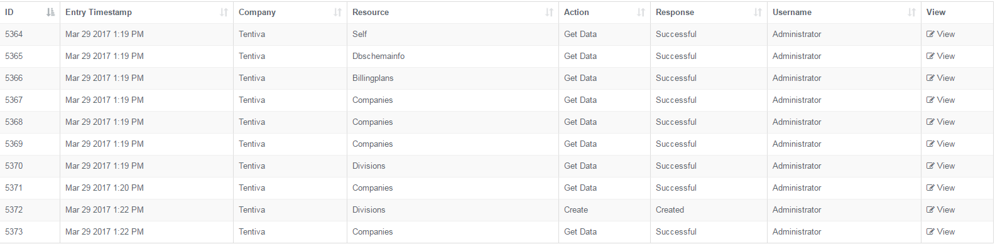
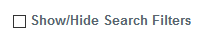

# Audit Logs

## Purpose of this Guide

This article describes the details of the Audits logs. It can be reached
from the Maintenance menu entry.

## Audits

A company's portal user activity can be monitored in order to observe
and discover any kind of misuse attempts, and to support customer
claims.

### Listed Transactions

The following pieces of information are displayed in the table:

|                 |                                                                                                     |
|-----------------|-----------------------------------------------------------------------------------------------------|
| ID              | A generic identification number assigned by the system.                                             |
| Entry Timestamp | The date and time attributes registered for an update event.                                        |
| Company         | The designation of the company.                                                                     |
| Resource        | The name of the resource type that has been modified or updated, such as Opening Hours or Keywords. |
| Action          | The type of transaction that was performed, such as Create or Get Data.                             |
| Response        | The respond provided by the system to the activity or transaction performed.                        |
| Username        | The name of the user who executed the transaction.                                                  |

### Search Console

You can apply a number of filtering options in order to narrow the
search results.

 

**Applying Search Filters**

1.  Navigate to ***Maintenance → Audits***.  
     
2.  Use the **Show/Hide Search Filters** checkbox to expand the search
    field.  
     
3.  Apply the filters that best fits your search requirements. See table
    below for description.  
     
4.  Click ***Apply Filter*** to run the search.

|             |                                                                                                                                                                                |
|-------------|--------------------------------------------------------------------------------------------------------------------------------------------------------------------------------|
| Date From   | Use the date picker to set the start date of the search.                                                                                                                       |
| Date To     | Use the date picker to set the end date of the search.                                                                                                                         |
| Company     | This lists the companies registered on the portal. Only those entries will be visible that are associated with the particular portal user. Select one from the drop-down list. |
| Resource    | This lists the available resources on the portal, such as Opening Hours or Keywords. Select one from the drop-down list.                                                       |
| Action      | This lists the available activities that can be performed on the portal, such as Create or Get Data. Select one from the drop-down list.                                       |
| User        | This lists the registered portal users. Select one from the drop-down list to check its activity.                                                                              |
| Response    | This lists the available responds to the particular actions. Select one from the drop-down list.                                                                               |
| Data Search | This is a free text field. Enter the text to search for.                                                                                                                       |

Use the **Clear Filter** button to erase all selected filters.
