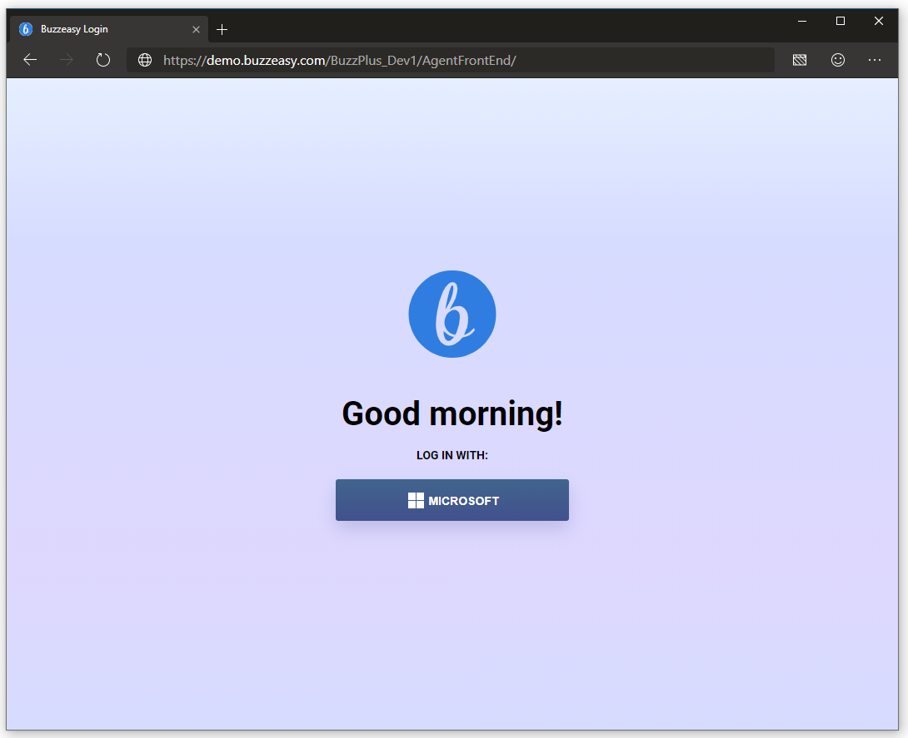
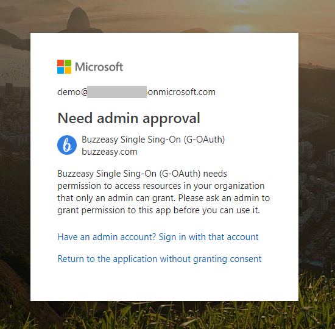
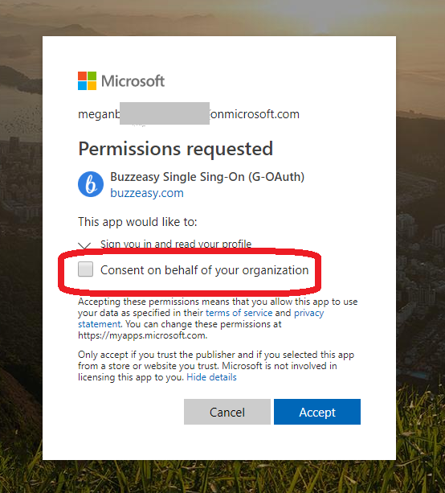
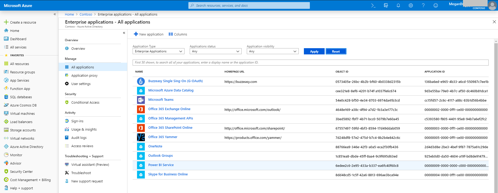
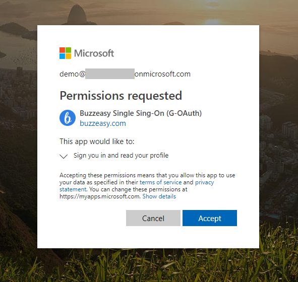

# Buzzeasy Single Sign-On

## Introduction

Buzzeasy services are using standard OAuth/OpenID based authentication and authorization of the users, so singe Sign-On is supported using Identity Providers that support these standards.

## Office365 and Azure Active Directory based Single Sign-On

One of the standard Identity Providers of Buzzeasy is Azure Active Directory. This means that users can login to Buzzeasy using their Office 365 username/password.

> [!NOTE]
> In case Azure AD Connect is configured in [Hybrid identity](https://docs.microsoft.com/en-us/azure/active-directory/hybrid/) mode the users can login with their on-premises Active Directory username and password.

### User Login

Buzzeasy does not get the password of the user, the authentication is performed by Azure Active Directory after the users clicks to the "LOG IN WITH MICROSOFT" button.

In case the user already logged in to Office 365 the username/password is not prompted, the user will be authenticated based on the existing O365 session and will be authorized based on that information by the Buzzeasy Single Sign-On.

### Azure Active Directory Configuration

Buzzeasy Single Sign-On Service must have permission in the Azure Active Directory of the Company to sign the user in and to read the basic profile information of the user.

Buzzeasy Single Sign-On is a Cloud Application registered in the Azure Active Directory of Buzzeasy and shall be added to the Company Azure Active Directory as an Enterprise Application. This consent can be given by the individual users or by the administrator of the Company. This is configured under the *Azure AD Enterprise Application - User settings* section if an individual user can give the consent or it must be granted by an enterprise admin.

In case in the "*Users can consent to apps accessing company data on their behalf*"user setting is set to No, the users will have the following notification when they are trying to sign-in at the first time without Company wide consent:

When an admin is trying to log in, the following screen is displayed that is giving to option to the admin to give consent to the entire company:

Once the consent is given, the Buzzeasy Single Sign-On application will show up on the list of Enterprise Applications:

In case in the "*Users can consent to apps accessing company data on their behalf*"user setting is set to Yes (Default setting), the users can provide consent themselves:

> [!NOTE]
> This consent need to be given only once, so the next login will automatically authenticate the user based on the Company Azure AD account information. The consent can be revoked by deleting the application from the Enterprise Applications.
