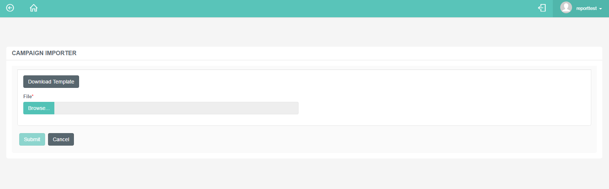

# Campaign Importer for Surveys

## Purpose of This Guide

This guide describes the method of uploading a campaign file including
the phone numbers to receive the survey questions. It also explains the
usage of the template file used for the importer.

## Campaign Importer

Customers can share their opinions by replying to the survey questions
sent in text messages. The system sends the text messages to the
contacts defined in the file.

### How to Upload a Campaign File?

1.  Navigate to ***Survey → Campaign Importer***.  
     
2.  Select the company which would like to send text messages to their
    customers.  
     
3.  Choose the campaign file by clicking the **Choose file** button.  
     
4.  Click **Upload** to finish the procedure.

After the file is uploaded, it instantly starts to process to send the
messages based on the details provided in the file.

Details, such as:

-   Customer name
-   Phone number
-   Campaign
-   Scheduled Time
-   Any custom data, like reference or account numbers

If there are any messages to be processed immediately, these will be
displayed on the company's wallboard at once.

### Download Template File

The possibility is given to download an empty importer file, so the
administrators can fill the details and upload the file to be processed.

1.  Navigate to ** ***Survey → Campaign Importer***.  
     
2.  Use the **Download Template** button to have the empty sheet.  
     
3.  Fill in the details as described below.  
     
4.  Upload the file. Follow the steps defined above.

#### Elements of the Template File

The template file is a simple excel sheet that needs to be filled with
basic details, such as what phone number to send the SMS or in which
region the customer is located.

The file contains the following columns:

<table>
<colgroup>
<col style="width: 50%" />
<col style="width: 50%" />
</colgroup>
<tbody>
<tr class="odd">
<td>First Name, Last Name</td>
<td>The recipient's name.</td>
</tr>
<tr class="even">
<td>Phone Number</td>
<td>The recipient's phone number. Provide numbers only. If the Region is not added, use the general format (E.164) for international phone numbers.</td>
</tr>
<tr class="odd">
<td>Campaign ID</td>
<td>Specify the identification number of the campaign from which to send the SMS.</td>
</tr>
<tr class="even">
<td>Region</td>
<td>Specify the time zone of the customer. This is important to determine the format of the phone number.</td>
</tr>
<tr class="odd">
<td>Fields</td>
<td>Optional fields to include further information on the callback request or any kind of custom data, such as an account number.</td>
</tr>
<tr class="even">
<td>Scheduled Time</td>
<td>
Specify the time of the message delivery.

Follow this pattern when adding the scheduled time: DD-MM-YR HH:MM

</td>
</tr>
</tbody>
</table>
