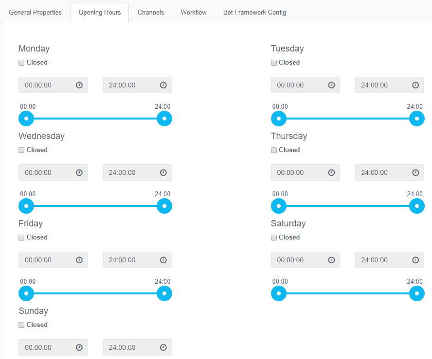

# Chat Services

## Purpose Of This Guide

 

## Prerequisites 

-   Workflow will need to be configured before a chat service can be
-   Bot Framework configuration is required if this is to be enabled
-   SMS configuration is required if this is to be enabled  
      

## Chat Service

 

### Creating a new Chat Service

<table>
<colgroup>
<col style="width: 100%" />
</colgroup>
<thead>
<tr class="header">
<th>Creating a new Chat Service</th>
</tr>
</thead>
<tbody>
<tr class="odd">
<td><ol>
<li>Navigate to <em><strong>Chat → Chat Services</strong></em></li>
<li>User the <strong><em>+New Chat service</em></strong> button to create a new entry</li>
<li>Populate the setup properties as described below</li>
<li>Click <strong><em>Submit</em></strong> to save the entry</li>
</ol></td>
</tr>
</tbody>
</table>

#### General Properties

|            |                                                           |
|------------|-----------------------------------------------------------|
| Name       | Specify the account's unique designation.                 |
| Department | Choose the associated department from the drop-down list. |
| Enabled    | Check to enable the chat service when ready to use        |

 

 

 

 

 

#### Opening Hours

|           |                                                     |
|-----------|-----------------------------------------------------|
| Day       | The day of the week you want to configure           |
| Open Time | The time in hh:mm you want to configure for opening |
| Enabled   | The time in hh:mm you want to configure for closing |

 

 

#### Channels

Within this tab, select what channels you would like to enable for chat.
The current available channels are;

-   Bot Framework
-   SMS

 

 

 

 

#### Workflow

Within this tab, set which workflow from the dropdown list to use for
the chat service. 

|          |                                                           |
|----------|-----------------------------------------------------------|
| Workflow | The name of the workflow to be used for this chat service |

Workflow is the routing of the conversation. This is configured in a
separate menu

 

 

 

 

#### Bot Framework Config (If Enabled)

Within this tab, set the configuration required to enable Bot Framework
within the chat service. 

|                      |                                                                                                                                     |
|----------------------|-------------------------------------------------------------------------------------------------------------------------------------|
| Microsoft App ID     | The application ID set when creating the Bot Channel Registration. This can be found on Azure portal.                               |
| Microsoft App Secret | The app secret as part of the provisioning of the Bot Channel Registration. A New one can be created within the Azure Portal        |
| Facebook Page Secret | The page secret of the Facebook Page used in conjunction with the Bot Framework. This can be found in the Facebook Developer Portal |

 

 

 

#### SMS Config (If Enabled)

Within this tab, set the configuration required to enable SMS as a
channel within the chat service

|            |                                                                   |
|------------|-------------------------------------------------------------------|
| Account    | The SMS account you wish to use. This is normally the default one |
| SMS number | The Dedicated Long Number to use for this chat service.           |

Note

Once a SMS number has been assigned to a chat service, it is no longer
available for other chat services

 

