# Designing In-Queue Callbacks and Announcement Groups

## Purpose of this Document

This guide describes the steps of creating and maintaining the In-Queue
Callback entries and IVR lines registered via the portal.

### Creating a New In-Queue Callback Entry

**Creating a New IQCB Entry**

1.  Navigate to ***IVR → Menus***.  
     
2.  Use the **+New Menu** button to create a new entry.  
     
3.  Specify the details described below.  
     
4.  Click ***Submit*** to save the changes.

You need to have an Inbound Number and Announcement Groups created first
in order to save an IVR Menu.

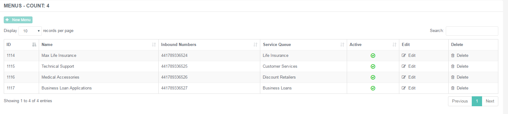

#### General Properties Tab

This tab represents the basic properties of an IVR line.

|                    |                                                                                                                                      |
|--------------------|--------------------------------------------------------------------------------------------------------------------------------------|
| Name               | Unique designation of the IVR menu entry.                                                                                            |
| Service Queue      | Select the service queue associated with this line. Available queues are related to the company where the portal user is registered. |
| Type               | Select the type of the line. It can be either an *In-Queue Callback* line or an *Out of Hours* one.                                  |
| Announcement Group | Select the announcement group associated with this line.                                                                             |

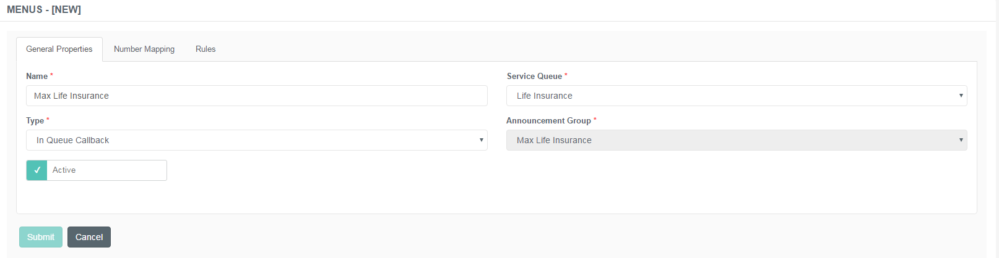

#### Number Mapping Tab

When a menu is configured an inbound public number needs to be assigned
to the menu, so the in queue call back or out of hours service can be
reached via this phone number.

 

**Add Number Mapping**

Specify the public number and click ***Add*** to include it in the list.

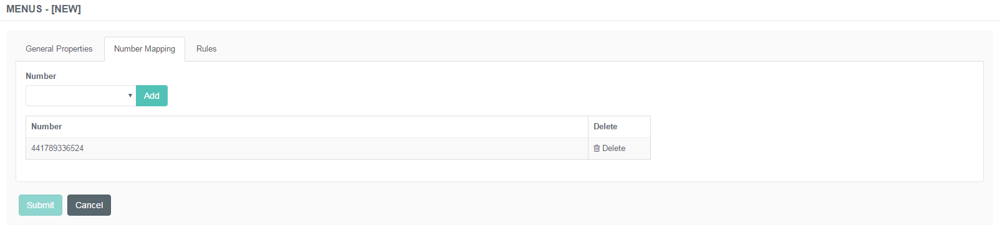

#### Rules Tab

This tab represents the Rules function. Here you can set how the actual
IVR line should behave in certain scenarios.

 

|                                     |                                                                                                                                                                            |
|-------------------------------------|----------------------------------------------------------------------------------------------------------------------------------------------------------------------------|
| Retry Threshold                     | Specify the number of retry attempts (bad input or no entry) before transferring back to queue.                                                                            |
| Transfer Number                     | Specify the number to transfer the customer's call to in case of unavailability or problems.                                                                               |
| Enable Call When Available          | Use this to enable the CWA feature for the specific IVR line.                                                                                                              |
| Enable Schedule Calls               | Use this to enable the callback offer with scheduling options. This is in relation with the callback slots specified for a service queue.                                  |
| Play Initial Offer                  | Use this to enable the callback offer announcement at the beginning of the IVR line.                                                                                       |
| Enable EWT                          | Use this to enable the announcement of the EWT when being in the queue.                                                                                                    |
| Enable Custom Announcement Override | Use this if the default announcements should be replaced with custom ones.                                                                                                 |
| Detect Incoming Number              | Detects the number of the incoming call if it is retained during transferring to Buzzeasy.                                                                                 |
| Enable Recording of Name            | Use this to record the name of the contact, which can be announced to the agent as a whisper before the transfer.                                                          |
| Enable Account Number               | Use this to collect the account number of the contact and announce it to the agent as a whisper before the transfer. Specify the minimum and the maximum number of digits. |

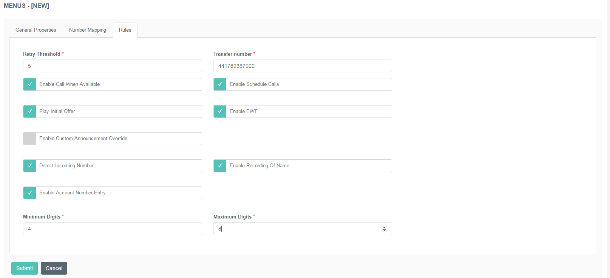

#### Announcement Overrides

This tab appears if the ***Enable Custom Announcement Override***
function is checked on the *Rules* tab.

 

Specify the following:

|                   |                                                              |
|-------------------|--------------------------------------------------------------|
| Announcement Type | Select the announcement description from the drop-down list. |
| File Name         | Enter the name of the announcement file.                     |

Announcement files should be sent over to Geomant to be uploaded.

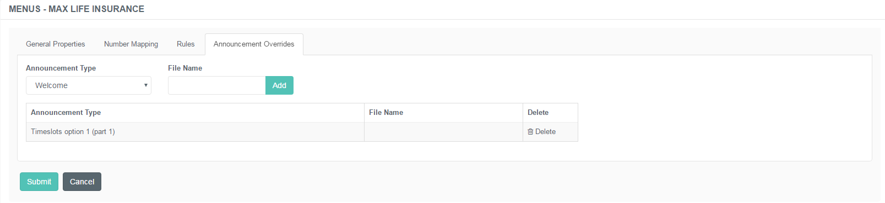

### Assigning Announcements to In-Queue Callback Menu

Here you can manage the announcement groups tailored to a company's
needs and requirements. These specially created groups can be assigned
to the different IVR lines.

 

**Create a New Announcement Group**

1.  Navigate to ***IVR → Announcement Groups***.  
     
2.  Use the **+New Announcement Group** button to create a new entry.  
     
3.  Specify the details described below.  
     
4.  Click ***Submit*** to save the changes.

 

Specify the following:

|                    |                                                         |
|--------------------|---------------------------------------------------------|
| Name               | Specify a unique designation for the group.             |
| Company            | Select the company associated with the group.           |
| Announcement Style | Choose whether the announcement is TTS or a sound file. |

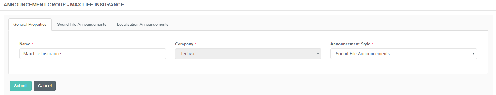

#### TTS Announcements

This tab appears if the ***TTS Announcements*** style is selected.

 

|                        |                                                              |
|------------------------|--------------------------------------------------------------|
| Announcement Type      | Select the announcement description from the drop-down list. |
| Text                   | Enter the text of the announcement.                          |
| Create Default Entries | It creates a list of default TTS messages for message types. |

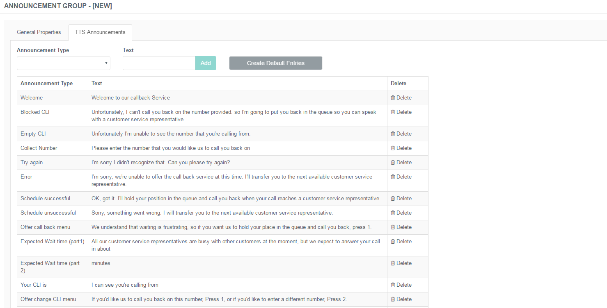

 

#### Sound File Announcements

This tab appears if the ***Sound File Announcements*** style is
selected.

Only .wma file extension can be uploaded.

The files need to be in the following format:

|                     |          |
|---------------------|----------|
| File format / codec | WMA      |
| Channels            | 1 (mono) |
| Sample rate         | 16 KHz   |
| Sample size         | 16 bit   |
| Encoding bit rate   | 16 Kbps  |
| Maximum file size   | 4 MB     |

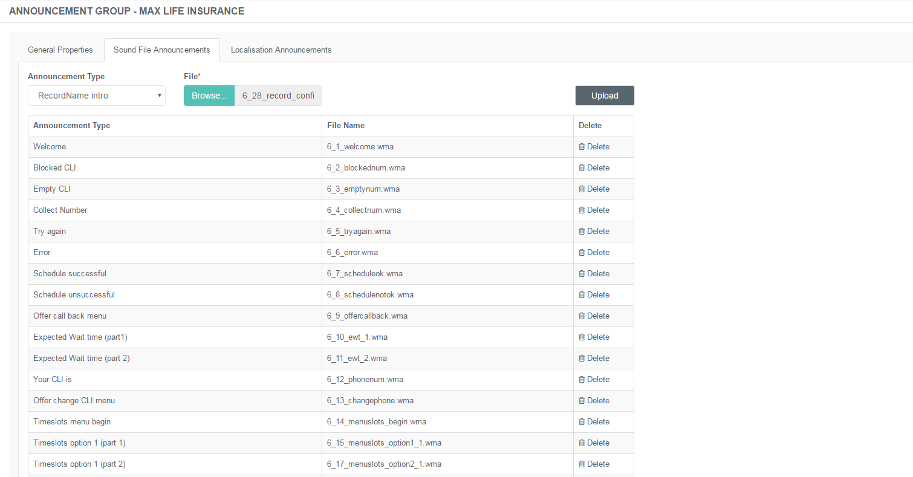

#### Notice on Sound File Announcements

The newly created Announcement Group must be saved first in order to add
audio files to it!

During the process of creating a new group on the Sound File
Announcement tab an error message prompts the user to save the record
first before uploading the files.

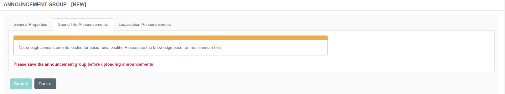

|                   |                                                                 |
|-------------------|-----------------------------------------------------------------|
| Announcement Type | Select the announcement description from the drop-down list.    |
| File              | Choose the relevant audio file to add to the list.              |
| Upload            | Uploads the selected file to the particular announcement group. |

 

#### Uploading Announcement Audio Files

Customers have the possibility to upload their own pre-recorded audio
files to various announcement groups.

**Create a New Announcement Group**

1.  Navigate to ***IVR → Announcement Groups***.  
     
2.  Create the new **Sound File Announcement Group** as described
    above.  
     
3.  After saving the entry you will be navigated back to the Summary
    page where all the announcement groups are listed.  
     
4.  Click *Edit* of the newly created announcement group.  
     
5.  On the *Sound File Announcement* tab, select the type of the
    particular message.  
     
6.  **Browse** the file on your storage location.  
     
7.  After selecting the file, click **Upload** to add it to the list.

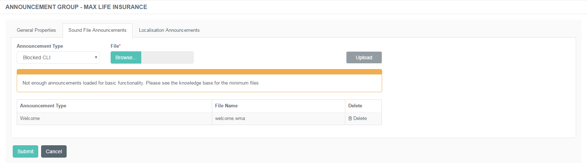

#### Localisation Announcements

The localisation bundle is a separate set of custom announcements for
numbers and dates. These can be uploaded in a different tab of the
Announcement Group menu.

1.  Navigate to ***IVR → Announcement Groups***.  
     
2.  Create the new **Sound File Announcement Group** as described
    above.  
     
3.  After saving the entry you will be navigated back to the Summary
    page where all the announcement groups are listed.  
     
4.  Click *Edit* of the newly created announcement group.  
     
5.  On the *Localisation Announcements* tab, select the type of the
    particular number or date message.  
     
6.  **Browse** the file on your storage location.  
     
7.  After selecting the file, click **Upload** to add it to the list.

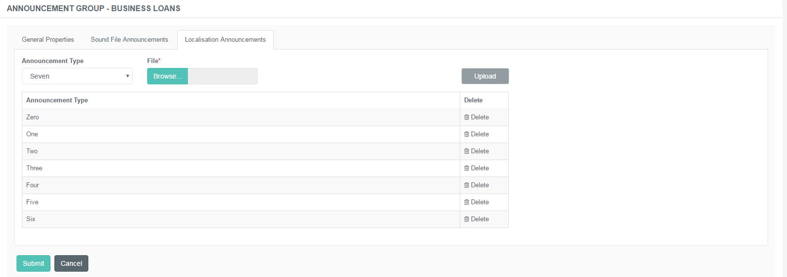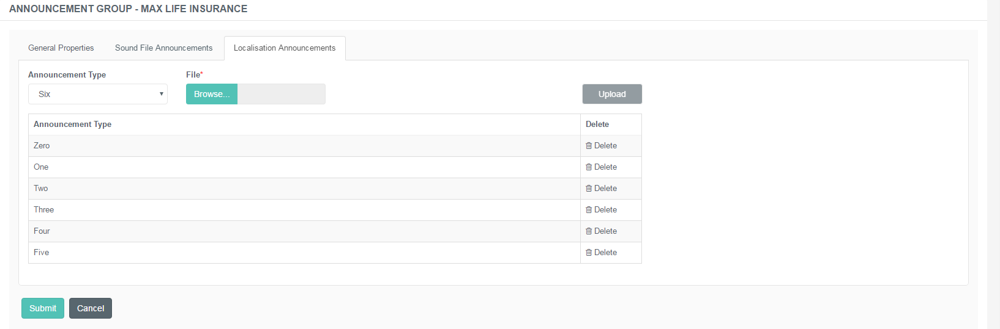

