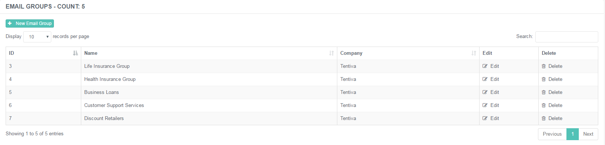
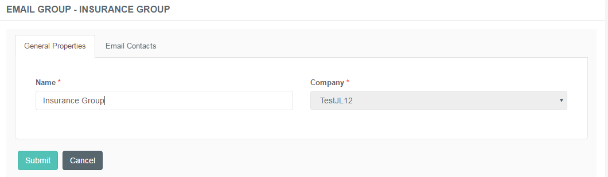
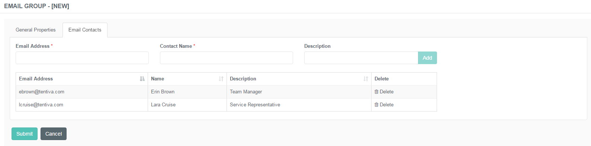

# Email Groups

## Purpose of this Guide

This guide describes the steps of creating and maintaining email groups
registered on the admin console.

## Email Groups

Email Groups are a set of email addresses which belong to the call
center of the customer.

This function is used if the customer decides not to send callback
requests via text messages to their clients, but the Contact Center and
its members should be informed of unsuccessful or lost calls via
automated emails. An email is sent to specified members of the CC if the
call of a client has failed notifying the call center to take actions on
it - either offer a callback or connect with the client in another way.

### Creating a New Email Group

**Creating a New Email Group**

1.  Navigate to ***Maintenance → Email Groups***.  
     
2.  Use the **+New Email Group** button to open the new entry creation
    form.  
     
3.  Specify the details described below.  
     
4.  Click **Submit** to save the changes.

An email group has the following specifications:

#### General Properties

|         |                                                        |
|---------|--------------------------------------------------------|
| Name    | Unique designation of the group.                       |
| Company | Select the associated company from the drop-down list. |

#### Email Contacts

After specifying general properties, you can add the related email
addresses to the group.

|               |                                                              |
|---------------|--------------------------------------------------------------|
| Email Address | Enter the email address of the contact.                      |
| Contact Name  | The name of the contact who has the email address specified. |
| Description   | Free text field to add notes of the contact.                 |
| Add           | Use this button to include the address in the group.         |

