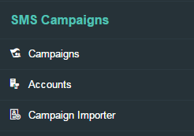

# Getting Started with Administration

## Login Using Standard Credentials

Buzzeasy Portal uses a basic authentication method which requires a
simple *login-password* credential pairing to enter the admin console. 

**Login to the Admin Portal**

1.  Navigate to the administration console.
    (<https://portal.buzzeasy.com/admin>)  
     
2.  Enter your unique credentials provided by *Geomant*.  
     
3.  Click ***Login***.

## User Interface

Built-in Roles

After a successful login you will be able to access different features
of the Buzzeasy Portal depending on the type of role assigned to your
specific user.  
The [Built-in
Roles](Access_Control_-_Role_Assignment_and_Resource_Types.md)
chapter describes the available extent for predefined roles.

 

Buzzeasy Portal is a responsive web application that works seamlessly on
PC's, mobile devices and tablets.

The user interface is composed of the following elements:

-   Top bar
-   Side bar
-   Transparent menu items  
     

### Navigation on the Portal

The top toolbar provides the following functionalities as well as
showing the details of the user logged in:

|                                                    |                                                                                          |
|:--------------------------------------------------:|------------------------------------------------------------------------------------------|
| | Home button. Use it to navigate instantly to the Start Page from anywhere on the Portal. |
| | Hide and show menu button. Use it to expand or collapse the menu bar.                    |
| | Logout button. Use it to logout from the portal.                                         |
| | Help button. Leads to the Knowledge Base.                                                |

 

### Start Page

After login the user will be presented with the Start Page. 

### User Details

Users of the portal are able to create and modify certain details
related to the company accounts and they can access other functions, as
well.  

User details can be found in the top right corner of the console which
shows details of the logged-in user and its assigned role. The users can
either lock the screen or change their passwords from here. 

#### Changing a password

The password change window is quite straightforward. 

**How to Change the Password?**

1.  Navigate to User Details.  
     
2.  Click ***Change Password**.*  
     
3.  A pop-up window will appear.  
     
4.  Enter your current password.  
     
5.  Enter the new password and again to confirm it.  
     
6.  Click ***Submit***.

#### Locking the Screen

The Lock Screen function regulates access to the Portal. The user will
be signed out temporarily and must enter the password to receive access
again.

### Menu Bar

The main functions are located in the menu bar at the left. The menu can
be displayed in a compressed icon mode or expanded to display the name
of the items by clicking the Show/Hide button.

#### Organisation Menu

|             |                                                                       |
|-------------|-----------------------------------------------------------------------|
| Companies   | Maintain the list of companies interacting with Buzzeasy.             |
| Departments | Maintain the different divisions operating within a specific company. |

#### Callbacks Menu

|                        |                                                                               |
|------------------------|-------------------------------------------------------------------------------|
| Contact Centre Numbers | Maintain the phone numbers related to the different service queues.           |
| Service Queues         | Maintain and configure service queues related to certain divisions.           |
| Callback Slots         | Maintain the timeslots determined for the operating hours of the departments. |
| Call Pacers            | Maintain the capacity settings for service queues.                            |

#### SMS Campaigns

|                   |                                                                                      |
|-------------------|--------------------------------------------------------------------------------------|
| Campaigns         | Maintain and configure the SMS campaigns used to offer queue-less callback requests. |
| Accounts          | List of accounts set up for different customers to isolate the billing process.      |
| Campaign Importer | Upload template file containing details of text messages to be sent out to contacts. |

#### IVR

|                     |                                                                                        |
|---------------------|----------------------------------------------------------------------------------------|
| Menus               | Maintain and configure each separate menu item of the In Queue Callback and IVR lines. |
| Inbound Numbers     | List of phone numbers assigned to IVR menus.                                           |
| Announcement Groups | Management of announcements assigned to IVR menus.                                     |

#### Access Control Menu

|               |                                                                                              |
|---------------|----------------------------------------------------------------------------------------------|
| User Accounts | Create new and maintain existing user accounts. This menu includes role assignment, as well. |

#### Maintenance

|              |                                                                                         |
|--------------|-----------------------------------------------------------------------------------------|
| Audits       | List of changes made via the portal.                                                    |
| Email Groups | Set of email addresses configured to receive email notifications of unsuccessful calls. |

