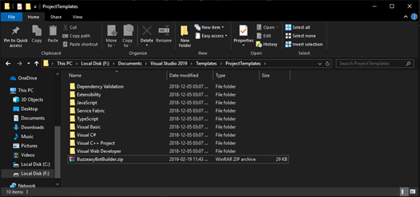
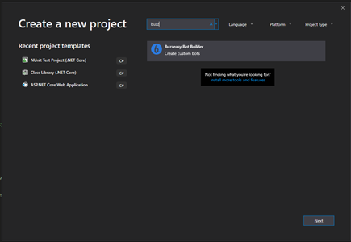
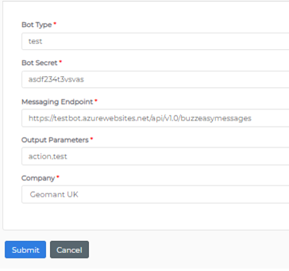
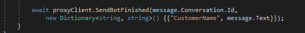
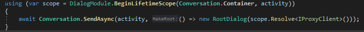
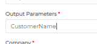
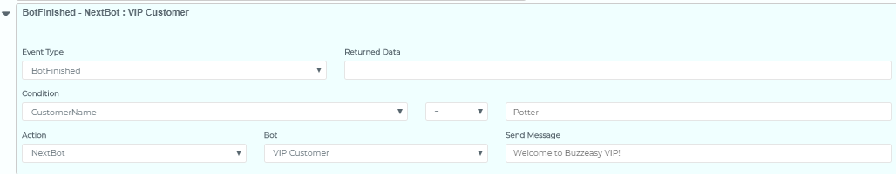

# How to create a custom bot in Buzzeasy

This article has been setup for any custom development required to build
a custom bot dialog within Buzzeasy. Buzzeasy BYOB (bring your own bot)
feature allows bespoke development to be part of the customer workflow.
The target audience of this is aimed for any development using the
following;

-   Visual Studio
-   C\#  
      

## Step-by-step guide

1.   Download the Visual Studio Template provided by Buzzeasy. This can
    be found at
    <https://buzzeasychatfiles2.blob.core.windows.net/chatbuilder/BuzzeasyBotBuilder.zip>
2.  Once downloaded, copy the zip file into the following location:
    Documents\\Visual Studio\<Version\>\\Templates\\ProjectTemplates  
      
    
3.  Start Visual Studio and create a new project using the newly
    imported template  
    
4.  Once the project has been created, an Azure storage account will
    need ot be created in Azure. This can be done by following this
    link:
    <https://docs.microsoft.com/en-us/azure/storage/common/storage-quickstart-create-account?tabs=azure-portal>
5.  Upon creation of the storage account, please save the connection
    string as this will be needed.
6.  Open the web.config file within the new project and paste the
    connection string into the TableStoreConnectionString
7.  By default the project set to use the Bot Framework Emulator But you
    can change it by  
    1.  Open the WebApiConfig.cs
    2.  Go to the region "Buzzeasy Bot Builder"
    3.  Uncomment this region if you want to enable connection to
        Buzzeasy Platform
    4.  If the emulator is required, simply comment this region for
        debugging
8.  Develop your chatboat as per a standard Microsoft Bot Framework V3.0
    bot. Samples can be found

    https://github.com/Microsoft/BotBuilder-V3/tree/master/CSharp/Samples 

9.  Once the chatbot dialog has been completed, then it is time to
    register the bot within the buzzeasy portal
    1.  Navigate to <https://portal.buzzeasy.com>
    2.  Login with credentials provided
    3.  Navigate to Chats -\> Bots
    4.  Create a new bot registration
        1.  Enter name of bot in bot type field. This name will be shown
            within the workflow routing
        2.  Generate a secret
        3.  Past the url of the messaging endpoint where your bot is
            hosted. An example of this will be like this:
            https://{yourbot}.azurewebsites.net/api/v1.0/buzzeasymessages
        4.  save the secret as this will be needed be entered in the
            web.config file of the project
        5.  Set the output parameters. This will be the parameters that
            will be returned by your custom bot when you send a bot
            finished event to Buzzeasy  
            
10. Paste the secret into the AppSecret field within the web.config of
    the project
11. Your bot has now been successfully registered and is ready to be
    added to workflow

 

### How to send data from Custom Bot to the workflow

 

If you want to send data back to Buzzeasy when the bot dialog has
finished, you can pass any data in the BotFinished event within the
additional data dictionary:

You can use the proxy client if you have one:

(If you use our template you can get an instance in the dialogs by add
the IProxyClient to the constructor and resolve from the scope)

Or you can Post the BotFinished event to the
https://\<ServiceUrl\>/\<ConversationId\>/finished URL

You can use this data in the workflow:

1.  Add the key to the Output Parameters on the Portal/Chat/Bots page  
    
2.  Add a new event
3.  Set the Event Type to BotFinished
4.  Add a new condition
5.  And you can choose the key in the Condition  
    

Workflow routing setup can be configured and instructions are available
here

 

1.

