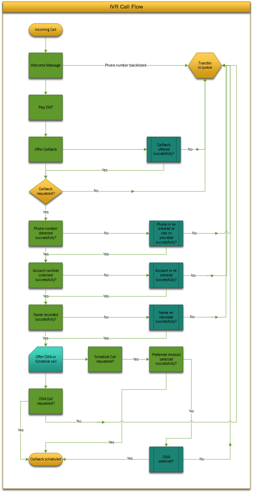

# IVR Call Flow

## Purpose of This Guide

This article includes a diagram of the IVR self-service menu, including
the announcements, explaining what happens to the call when a certain
menu is selected.

The meaning of the announcements is found in the **[List of
Announcements](List_of_Announcements.md)**
article.

### Acronyms

|     |                                                                                                                                                                      |
|-----|----------------------------------------------------------------------------------------------------------------------------------------------------------------------|
| CWA | Call When Available. The client will be contacted as soon as a customer service representative becomes available.                                                    |
| EWT | Estimated Wait Time. The system announces the time the client calling the service line needs to wait in queue before allocated to a customer service representative. |

