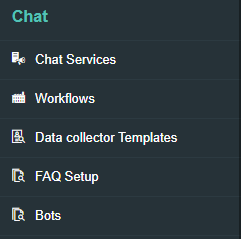
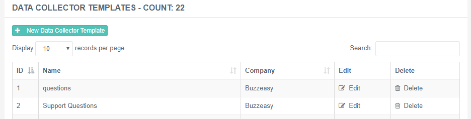
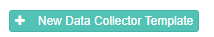
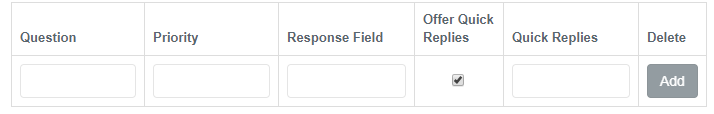

# Interaction Template and Questions

## Overview

This section includes the administration of interaction templates and
questions

This includes the following

-   Interaction Templates
-   Interaction Questions

 

 

### Interaction Templates

An interaction template is a group of questions that can be set. This
template will be used within the workflow routing to determine what
question, or group of questions will be asked to the visitor.

The list of interaction templates can be found by navigating to Chat -\>
Data Collector Template.

 

The view of templates can be seen in the main view of the portal. This
will enable you to view the templates and edit the templates if required

 

To add a template, simply click on the new Data Collector Template
button

 

### Adding a question

Simply enter in the question into the form with the valid properties and
press the add button to include a question within the template

 

|                     |                                                                                                                                   |
|---------------------|-----------------------------------------------------------------------------------------------------------------------------------|
| Question            | The question to ask                                                                                                               |
| Priority            | The priority/order the questions should be asked, this can be set to 1 if just a single question                                  |
| ResponseField       | The field name that will be used for the response. This is used within the workflow to route to the next action                   |
| Offer Quick Replies | Enable this to offer quick replies/suggested actions. Available on all channels apart from SMS                                    |
| Quick Replies       | Populate this in a comma separated format what the quick replies should be. This only shows if the offer quick replies is enabled |

 

 

 

