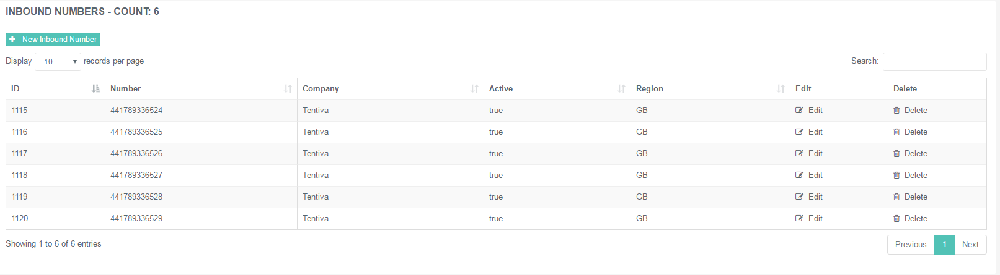
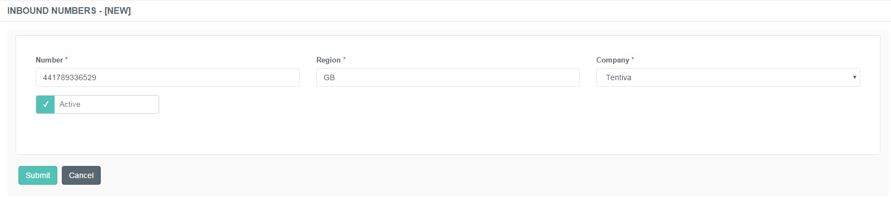

# Managing Inbound Numbers for In-Queue Callbacks

## Purpose of this Document

This page describes the steps of maintaining the inbound numbers
registered for in-queue and out of hours callbacks. These numbers are
assigned to different IVR menus, which belong to different service
queues. The calls are transferred over these numbers, so the customer
calling the call center is able to reach the Buzzeasy IVR. Customers are
offered a callback and scheduling options via the Buzzeasy IVR.

Inbound Numbers are provisioned by the Service Provider and being leased
to the customers.

Inbound Numbers are created by Geomant personnel.

### Creating a New Inbound Number

1.  Navigate to ***IVR → Inbound Numbers***.  
     
2.  Use the **+New Inbound Number** button to create a new entry.  
     
3.  Specify the details described below.  
     
4.  Click ***Submit*** to save the changes.

An inbound number has the following specifications:

|             |                                                                                                           |
|-------------|-----------------------------------------------------------------------------------------------------------|
| Number      | Specify the inbound number that is assigned to a specific company's IVR line.                             |
| Region      | Specify the associated region with the inbound number.                                                    |
| Company     | Choose the related company that takes the number in lease.                                                |
| Number Type | Select the type of the newly created inbound number. It can either be a *Cloud* number or a *Hybrid* one. |
| Active      | Check this box to enable the number.                                                                      |

Only distinct phone numbers can be saved.

Please be aware that *Announcement Group* and *Custom Announcement
Override* options are disabled in case of Hybrid numbers. The
announcement files has to be managed and configured locally, because it
is not possible to upload and change the audio files through the portal
if the IVR is at the customer's site.

