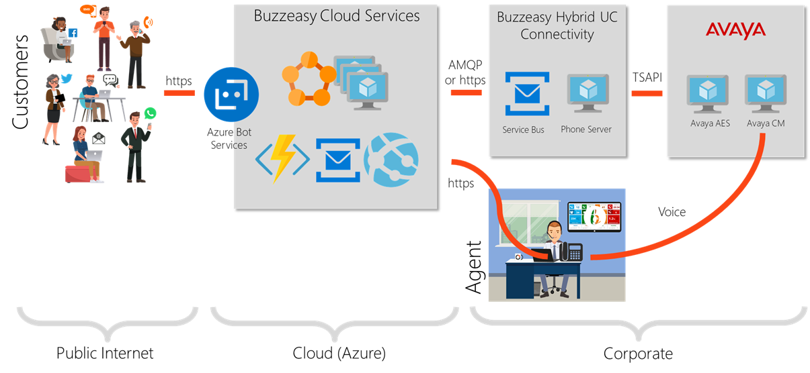

# Adding Avaya voice control to Buzzeasy

## Purpose of this Document

This article is meant to describe the steps to enabling Buzzeasy with Avaya voice control. 

### Overview

Avaya Communication Manager provides enterprise level voice capabilities to companies, however it lacks on the digital channels, that is why Buzzeasy is providing an integration option to Avaya CM, so that enterprises 
that are already using Avaya features can easily expand and blend interactions capabilities towards digital channels.

Adding Avaya voice capabilities to Buzzeasy is performed by using a hybrid connector that is installed on-premise, providing a connection to Buzzeasy managed services.



### Prerequisite 

**Hardware**

| Item              | Value                                                                                             | 
| :---------------- |:-----------------------------------------------------------------------------------               |
| Virtualization    | Supported                                                                                         |
| CPU               | Dual core Xeon 3 GHz processor with hyper-threading enabled                                       |
| RAM               | 4 GB of RAM                                                                                       |
| Storage           | 100 GB HDD with 7200 rpm rating at least                                                          |
| Network Driver    | One 100/1000 Base-T Ethernet full duplex controller (on-board Network Interface Cards (NICs))     |

**Software**

| Item              | Value                                                                                             | 
| :---------------- |:-----------------------------------------------------------------------------------               |
|OS | Windows Server 2008 R3 x64 or above |
|Avaya Communication Manager | Version 4.2 or above |
|Avaya Application Enablement Services | Version 4.2 or above <br> one TSAPI license is consumed per call observed station |
|Other | .NET Framework 4.6.1 <br> PowerShell version 5.0 or above |


**Firewall** 


| Service           | Default Port  | Direction | Protocol | Purpose                                                    | 
| :---------------- |:-------------:|:---------:|:--------:|:-----------------------------------------------------------|
| AES|450|In/Out|UDP|TSAPI service port|
| AES|1050-1065|In/Out|TCP|TSAPI service port range|                                      |
| Buzzeasy Cloud|5671|In|TCP (AMQP)|Secure AMQP based messsaging, proxies CTI events to Buzzeasy cloud|

### Installation

Follow these steps to install the on-premise call connector

1. Download the "CallControllerWinSvc.zip" ZIP file from Geomant website 
2. Extract ZIP file content in the folder you want to install the CallController e.g. `C:\Program Files\Buzzeasy Avaya Call Controller`
3. Start Powershell
4. Navigate to CallController folder e.g. `cd '.\Program Files\Buzzeasy Avaya Call Controller\'`
5. Run the `Install-CallController.ps1` Powershell script, specifying the following parameters:
    a. the IPv4 address of the Avaya AES server
    b. TSAPI link id, used to connect to the Avaya AES server
    c. TSAPI user name and account that is administered as a CT user on Avaya Application Enablement Services server
    d. Service Bus connection string

```Powershell
Install-CallController.ps1 10.168.3.83 TsapiLinkId='AVAYA#PBX#CSTA#AESNAME' TsapiUserName='ctuser' TsapiPassword='ctpassword' ServiceBusConnectionString='Endpoint=myEndpoint;SharedSecretIssuer=myWrapAuthenticationName;
SharedSecretValue=myWrapPassword;'
```


### Uninstall

Removing CallController service can be done by following these steps: 

1. Start PowerShell
2. Go to the CallController's folder
3. Run the `Uninstall-CallController.ps1` PowerShell script
4. Delete the CallController's folder

