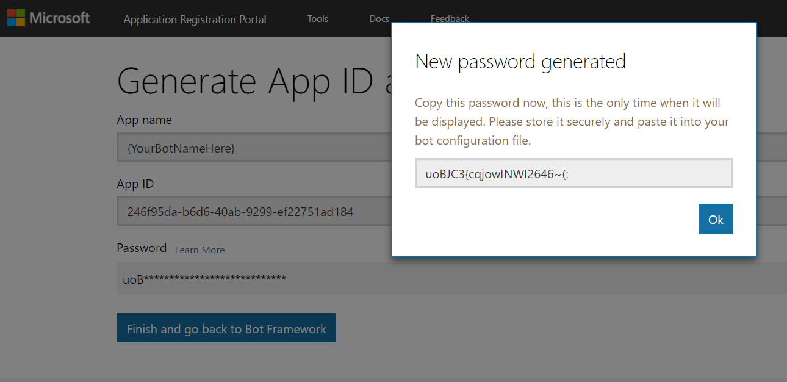

# Setup a Facebook page for Buzzeasy Chat

## Creating a Facebook Page

You need to create a Facebook page if your don’t have one.

You can list the pages that you mange at the following
link: <https://www.facebook.com/bookmarks/pages>

Please note the Page ID of your page that you can find on the About

 

## Creating Facebook App

Create a new Facebook App by navigating
to <https://developers.facebook.com/apps>

 

 

Enter the App Display name and the contact email address, press Create
App ID.

 

 

You will be taken to the Products section of your App. Please select
Messenger from the gallery and click Set Up

 

First you need to generate a Page Access token so that the application
can get access to your page. You must be a Page Admin to do that.

 

You will be prompted to login and on the next page to authorize that you
are the admin of the page.

 

There is a long string generated that is displayed in the Page Access
Token, please note that.

Now go to the Dashboard of your App.


Please note the App ID and the App Secret (click show to display).

## Setting up Bot Framework

### Create an App ID

Open the Microsoft App Registration portal in a browser, login with your
Azure AD account (corporate ID).

You can use this deep
link: https://apps.dev.microsoft.com/\#/quickstart/skypebot?appName={YourBotNameHere}

Please copy the Application ID (that is a GUID), click the button the
generate the password, copy that as well, you will need to enter that
later.

 

### Create the Bot Registration in Azure

#### Option A: Using Azure Resource Manager (ARM) template

Enter the bot name (ID), the App ID and password generated earlier into
the parameter JSON and create the resource using the ARM termplate.

**azuredeploy.parameters.json**  Expand source

``` text
{
    "$schema": "https://schema.management.azure.com/schemas/2015-01-01/deploymentParameters.json#",
    "contentVersion": "1.0.0.0",
  "parameters": {
    "botId": {
      "value": "Your_Bot_ID"
    },
    "location": {
      "value": "uksouth"
    },
    "kind": {
      "value": "bot"
    },
    "sku": {
      "value": "S1"
    },
    "siteName": {
      "value": "nosite"
    },
    "appId": {
      "value": "{enter the generated app GUID"
    },
    "appSecret": {
      "value": "{enter the generated password}"
    },
    "createNewStorage": {
      "value": false
    },
    "storageAccountName": {
      "value": ""
    },
    "storageAccountResourceId": {
      "value": ""
    },
    "botEnv": {
      "value": "prod"
    },
    "useAppInsights": {
      "value": false
    },
    "appInsightsLocation": {
      "value": ""
    },
    "createServerFarm": {
      "value": false
    },
    "serverFarmId": {
      "value": ""
    },
    "serverFarmLocation": {
      "value": ""
    },
    "azureWebJobsBotFrameworkDirectLineSecret": {
      "value": ""
    }
  }
}
```

**azuredeploy.json**  Expand source

``` text
{
    "$schema": "http://schema.management.azure.com/schemas/2015-01-01/deploymentTemplate.json#",
    "contentVersion": "1.0.0.0",
    "parameters": {
      "botEnv": {
        "type": "string",
        "defaultValue": "prod"
      },
        "botId": {
            "type": "string"
        },
        "location": {
            "type": "string"
        },
        "sku": {
            "type": "string"
        },
        "kind": {
            "type": "string"
        },
        "siteName": {
            "type": "string"
        },
        "createNewStorage": {
            "type": "bool"
        },
        "storageAccountName": {
            "type": "string"
        },
        "storageAccountResourceId": {
            "type": "string",
            "defaultValue": ""
        },
        "appId": {
            "type": "string",
            "defaultValue": "1234"
        },
        "appSecret": {
            "type": "string",
            "defaultValue": "blank"
        },
        "azureWebJobsBotFrameworkDirectLineSecret": {
            "type": "string",
            "defaultValue": ""
        },
        "zipUrl": {
            "type": "string",
            "defaultValue": ""
        },
        "proactiveZipUrl": {
            "type": "string",
            "defaultValue": ""
        },
        "useAppInsights": {
            "type": "bool"
        },
        "appInsightsLocation": {
            "type": "string"
        },
        "serverFarmId": {
            "type": "string"
        },
        "createServerFarm": {
            "type": "bool"
        },
        "serverFarmLocation": {
            "type": "string",
            "defaultValue": ""
        },
        "serverFarmSku": {
            "type": "object",
            "defaultValue": {
                "name": "S1",
                "tier": "Standard",
                "size": "S1",
                "family": "S",
                "capacity": 1
            }
        },
        "endpoint": {
            "type": "string",
            "defaultValue": ""
        },
        "luisApiLocation": {
            "type": "string",
            "defaultValue": "Global"
        }
    },
    "variables": {
        "storageAccountType": "Standard_LRS",
        "storageAccountId": "[if(or(parameters('createNewStorage'), equals('', parameters('storageAccountResourceId'))), resourceId('Microsoft.Storage/storageAccounts', parameters('storageAccountName')), parameters('storageAccountResourceId'))]",
        "serverFarmName": "[last(split(parameters('serverFarmId'), '/'))]",
        "myWorkerSize": 0,
        "proactiveFunctionName": "[concat(parameters('siteName'), '-function')]",
        "insightsName": "[concat(parameters('botId'), substring(uniqueString(resourceGroup().id), 0, 6))]",
        "config": {
            "scratch": {
                "stateEndpoint": "https://intercom-api-scratch.azurewebsites.net",
                "azureWebJobsBotFrameworkDirectLineEndpoint": "https://directline.scratch.botframework.com/",
                "blobStoreName": "icscratch",
                "openIdMetadata": "https://intercom-api-ppe.azurewebsites.net/v1/.well-known/openidconfiguration"
            },
            "ppe": {
                "stateEndpoint": "https://intercom-api-ppe.azurewebsites.net",
                "azureWebJobsBotFrameworkDirectLineEndpoint": "https://directline.ppe.botframework.com/",
                "blobStoreName": "intercomppe",
                "openIdMetadata": "https://intercom-api-ppe.azurewebsites.net/v1/.well-known/openidconfiguration"
            },
            "prod": {
                "stateEndpoint": "",
                "azureWebJobsBotFrameworkDirectLineEndpoint": "https://directline.botframework.com/",
                "blobStoreName": "connectorprod",
                "openIdMetadata": ""
            }
        },
        "botAppKinds": {
            "function": "functionapp",
            "sdk": "app",
            "designer": "app",
            "bot": ""
        },
        "botAppKind": "[variables('botAppKinds')[parameters('kind')]]",
        "currentConfig": "[variables('config')[toLower(parameters('botEnv'))]]",
        "siteHost": "[concat(parameters('siteName'), '.azurewebsites.net')]",
        "botEndpointConfig": {
            "bot": "[parameters('endpoint')]",
            "sdk": "[concat('https://', variables('siteHost'), '/api/messages')]",
            "designer": "[concat('https://', variables('siteHost'), '/api/messages')]",
            "function": "[concat('https://', variables('siteHost'), '/api/messages?code=', 'NYI')]"
        },
        "botEndpoint": "[variables('botEndpointConfig')[parameters('kind')]]",
        "luisApiName": "",
        "luisApiResId": "[resourceId('Microsoft.CognitiveServices/accounts/', variables('luisApiName'))]"
    },
    "resources": [
        {
            "apiVersion": "2017-12-01",
            "type": "Microsoft.BotService/botServices",
            "name": "[parameters('botId')]",
            "location": "global",
            "kind": "[parameters('kind')]",
            "sku": {
                "name": "[parameters('sku')]"
            },
            "properties": {
                "name": "[parameters('botId')]",
                "displayName": "[parameters('botId')]",
                "endpoint": "[variables('botEndpoint')]",
                "msaAppId": "[parameters('appId')]"
            },
            "dependsOn": []
        }
    ]
}
```

 

#### Option B: Create the Bot Registration resource in Azure Portal

##### Create the Azure Resource

Open the following URL:

<https://portal.azure.com/#create/Microsoft.BotServiceConnectivityGalleryPackage>

 

Enter the bot name (ID), the App ID and password generated earlier into
the “Microsoft App ID and password” parameter. Click Create.

##### Configure Facebook Messenger Channel

Go to Channels, select Facebook Messenger.

 

Enter the IDs and secrets taken during the Facebook Page and App
creation.


Please take a note of the Callback URL and the Verify token.

## Facebook App Configuration

Go back to the Facebook App configuration page.

### Configuring Facebook App Webhook

Click the Messenger settings under the Products section. Scroll to the
Webhooks section and click Setup Webhooks.

Paste the Callback URL and the Verify Token taken during the Bot
Framework configuration.

 

Under Subscription Fields, select message\_deliveries, messages,
messaging\_options, and messaging\_postbacks.

Click Verify and Save.

### Application Review

You need to submit your App for App Review, but before you can submit
for review, complete the following:

-   Your app must have App Icon (1024 x 1024) set.
-   Your app must have Privacy Policy URL set.
-   Your app must have Category set.

Go back to your page, and under the Page Setting, select Messenger
platform.

Configure Response method to hybrid:

 

 

Once you completed the above, go back to the App developer portal. Click
the Messenger settings under the Products section.

Go to **App Review for Messenger**, click to Add to Submission next to
the pages\_messaging section.

 

Click Add Details, complete the form based on your Bot dialogs.


Wait for the app approval that may take upto 5 days.

 

More info:

<https://docs.microsoft.com/en-gb/bot-framework/bot-service-channel-connect-facebook>

-   Page:

    [How to get qna maker subscription
    key](How_to_get_qna_maker_subscription_key.md)

-   Page:

    [Administration of Service
    Queues](Administration_of_Service_Queues.md)

-   Page:

    [How to setup Teams Agent
    Connector](How_to_setup_Teams_Agent_Connector.md)

-   Page:

    [Setup a Facebook page for Buzzeasy
    Chat](Setup_a_Facebook_page_for_Buzzeasy_Chat.md)

-   Page:

    [Designing In-Queue Callbacks and Announcement
    Groups](Designing_In-Queue_Callbacks_and_Announcement_Groups.md)

