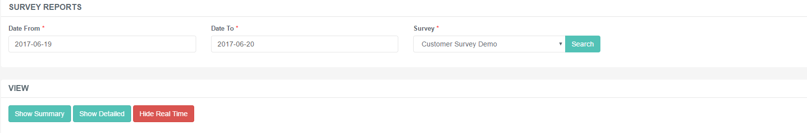
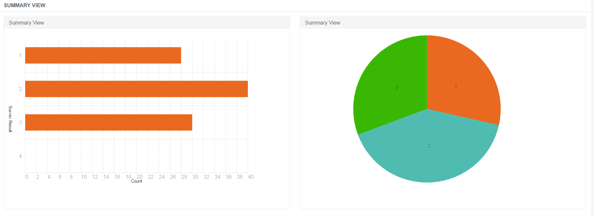
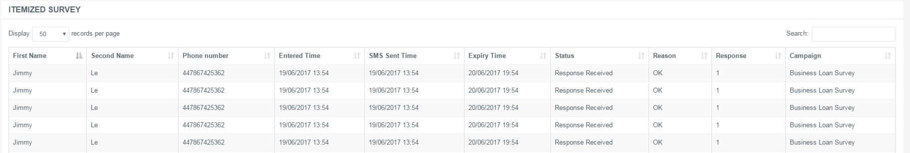
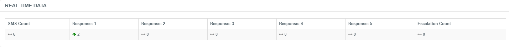

# Survey Reports

## Purpose of this Guide

This guide describes the management of the survey reports related to the
survey questionnaires sent via text messages to specific contacts.

## Survey Reports

The report displays the outcome of the company's survey campaigns from a
particular time period. It shows the results and level of responses on a
record basis.

Historical reports can display records up to 60 days of prior to the
current date and a maximum range of 30 days per report.

Get survey data right away by using the Real Time option.

### Report View

Follow the below steps to manage the reports of your survey campaigns.

**Survey Reports on Buzzeasy Portal**

1.  Navigate to ***Survey → Survey Reports***.  
     
2.  Select the time range of the report.  
     
3.  Select which report to display from the *Survey* drop-down.  
     
4.  Click *Search*.

#### Summary View

This is an aggregate view of the report, it displays the survey results
(responses) based on a daily selection.

There are two kinds of views:

|           |                                                                                                                                                        |
|-----------|--------------------------------------------------------------------------------------------------------------------------------------------------------|
| Bar view  | The vertical line represents the keywords, and the horizontal stands for the number of responses with the particular keyword within the search period. |
| Pie chart | A simple pie view with the same details as the bar view report.                                                                                        |

#### Itemized Survey

This is a definite report split into several pieces of information. The
table displays a detailed form of the survey results. Besides presenting
some basic information, like name and phone number, it also features
data on the campaign, the keyword and expiry time.

|                     |                                                                                                                   |
|---------------------|-------------------------------------------------------------------------------------------------------------------|
| First and Last Name | First name and last name of the contact.                                                                          |
| Phone Number        | Phone number of the contact.                                                                                      |
| Entered Time        | The time when the record was submitted to Buzzeasy for processing before sending it to the customer.              |
| SMS Sent Time       | The time when the text message was sent.                                                                          |
| Expiry Time         | The time when the record runs out after which Buzzeasy will not process any responses from the particular number. |
| Status              | Whether the response was received successfully or not.                                                            |
| Reason              | A feedback of the response delivery. It displays the error message if not successfully received.                  |
| Response            | The keyword that the contact can send via the text message.                                                       |
| Campaign            | The related campaign's name.                                                                                      |

#### Real Time Survey

Buzzeasy offers to monitor the shaping up of the results in an
instantaneous manner.

Use the Show Real Time button to get the data table.

The table consists of an SMS counter, the responses and an escalation
counter.

