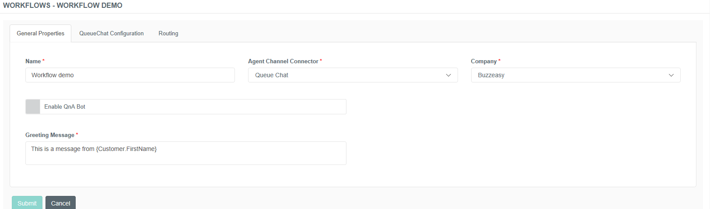
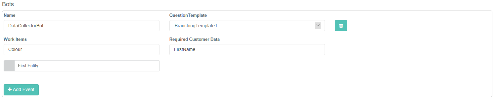
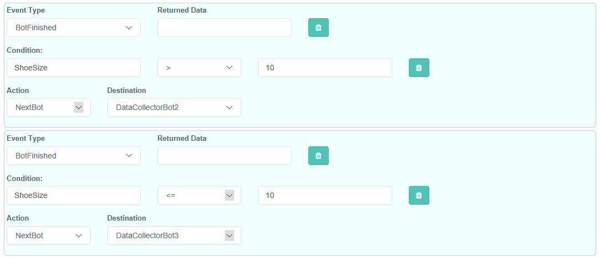
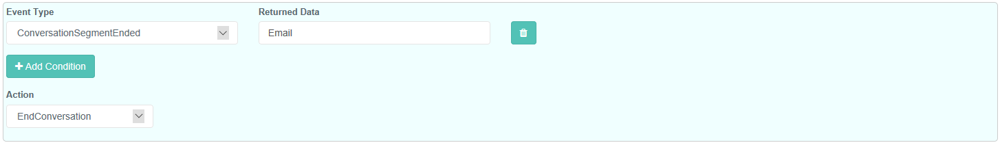

# Workflows

 ## Workflow

Workflows define how chat conversations will be treated throughout their
lifecycle.

 ### General Properties

<table>
<colgroup>
<col style="width: 50%" />
<col style="width: 50%" />
</colgroup>
<tbody>
<tr class="odd">
<td>Name</td>
<td>The Name of the workflow. This name is reused later in the Chat Service menu to select which workflow to attach to.</td>
</tr>
<tr class="even">
<td>Agent Channel Connector</td>
<td>Which agent channel connector to use for acquiring and relaying messages to agents.</td>
</tr>
<tr class="odd">
<td>Company</td>
<td>The tenant in the buzzeasy service.</td>
</tr>
<tr class="even">
<td>Enable QnA Bot</td>
<td>This option enables the integration with the Microsoft QnA Service. Enabling this feature on the workflow shows the QnA configuration selection.</td>
</tr>
<tr class="odd">
<td>QnA Maker Configuration</td>
<td>This selection appears when the QnA bot is enabled. These configurations are created in the QnA maker menu.</td>
</tr>
<tr class="even">
<td>Greeting Message</td>
<td>
The greeting message displayed to the agent when a user is connected to their chat session. It can contain placeholders about the chat which will be replaced with the relevant values when a chat starts. for instance {Customer.FirstName} will be replaced with the customer’s name, if known.
</td>
</tr>
</tbody>
</table>

#### Routing Tab

The routing tab is where the flow of the conversation is defined. Each
bot can be thought of as a step along the flow where you can branch off
to different bots or the agent pool depending on the results.

##### Bots

 

<table>
<colgroup>
<col style="width: 50%" />
<col style="width: 50%" />
</colgroup>
<tbody>
<tr class="odd">
<td>Name</td>
<td>
The name the bot will be addressed by. It must be one of the following:

QnABot

DataCollectorBot

A Name of a customer bot in the Bots menu

If you want to use multiple data collector bots with different question templates in your workflow you can append a number to the name, for instance DataCollectorBot2 or DataCollectorBot99
</td>
</tr>
<tr class="even">
<td>Work Items</td>
<td> A comma separated list of the work item data that can be passed to the bot. This gives you tight control of what data can be passed to and from bots</td>
</tr>
<tr class="odd">
<td>Required Customer Data</td>
<td>A comma separated list of the customer data that can be passed to the bot. This gives you tight control of what data can be passed to and from bots </td>
</tr>
<tr class="even">
<td>First Entity</td>
<td>The bot or agent with this check set will be the first one to be assigned on a new or reset conversation. Checking this will remove the check on any other bot or agent in the flow.</td>
</tr>
</tbody>
</table>

When a bot is finished with its part of the conversation it can return
either a BotFailed or BotFinished event. These events can return data to
the Buzzeasy platform which it can check against conditions to see which
action to do next. Each workflow can have multiple event definitions for
each event type for each bot as we can decide which one to use by the
matching condition.

<table>
<colgroup>
<col style="width: 50%" />
<col style="width: 50%" />
</colgroup>
<tbody>
<tr class="odd">
<td>Event Type</td>
<td>What type of event to match to, either Bot Failed or Bot Finished</td>
</tr>
<tr class="even">
<td>Returned Data</td>
<td>The customer data that the bot is allowed to edit. Any other customer data returned by the bot will be ignored by the platform</td>
</tr>
<tr class="odd">
<td>Condition</td>
<td>How to match the event. If there is no condition then it will match any event that doesn't match another event's conditions. The condition property can be any field that the bot returns in its additional data. In the case of the DataCollectorBot any question's ResponseField will be matchable for a condition.</td>
</tr>
<tr class="even">
<td>
Action
</td>
<td>What action to take when the event is matched. Either SendToAgent, NextBot or EndConversation</td>
</tr>
<tr class="odd">
<td>Destination</td>
<td>This is shown when NextBot is selected as the event action. The name of the bot to be assigned when this event is matched. It only shows bots which have been defined in this workflow so you may need to come back to fill this in once all the bots have been defined.</td>
</tr>
</tbody>
</table>

<table>
<colgroup>
<col style="width: 50%" />
<col style="width: 50%" />
</colgroup>
<tbody>
<tr class="odd">
<td>Event Type</td>
<td>What type of event to match to, either Conversation Segment Ended or Out of Hours</td>
</tr>
<tr class="even">
<td>Returned Data</td>
<td>The customer data that the bot is allowed to edit. Any other customer data returned by the bot will be ignored by the platform</td>
</tr>
<tr class="odd">
<td>Condition</td>
<td>How to match the event. If there is no condition then it will match any event that doesn't match another event's conditions. The condition property can be any field that the bot returns in its additional data. In the case of the DataCollectorBot any question's ResponseField will be matchable for a condition.</td>
</tr>
<tr class="even">
<td>
Action
</td>
<td>What action to take when the event is matched. Either SendToAgent, NextBot or EndConversation</td>
</tr>
<tr class="odd">
<td>Destination</td>
<td>This is shown when NextBot is selected as the event action. The name of the bot to be assigned when this event is matched. It only shows bots which have been defined in this workflow so you may need to come back to fill this in once all the bots have been defined.</td>
</tr>
</tbody>
</table>

